# Pyrat

## **Challenge Information:**

**Link:** [tryhackme.com/room/pyrat](http://tryhackme.com/room/pyrat)
**Difficulty:** Easy
**Category:** Boot-to-Root
**Description:**
- Name: Pyrat
- Description: Test your enumeration skills on this boot-to-root machine.
**Scenario:** 
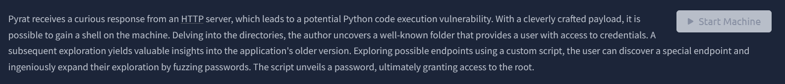

## TLDR

A Python socket server on port 8000 directly interprets user input, allowing a reverse shell as `www-data`. Credentials for user `think` are found in a `.git/config` file due to password reuse. Root is achieved by fuzzing a hidden `admin` endpoint on the same socket server and brute-forcing the password with a custom script.

## Initial Reconnaissance

### Nmap Scan: 

Command: `nmap -A -v <IP> -oN nmapresult.txt` 

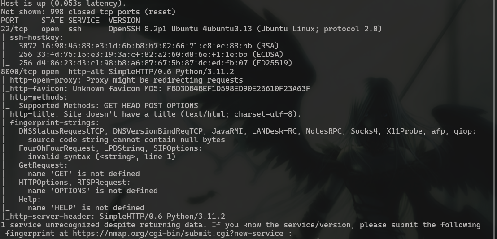

Scan showed two ports open: **22 (SSH)** and **8000** (identified by nmap as a Python-based server). Port 8000 became the primary focus first due to the lack of credentials for SSH login.

### Port 8000 — Python Socket Server

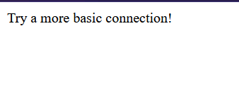

I tried `netcat` but did not see anything so i thought connection was not being successful and i tried `telnet` next. I was wrong and nc does work. The server is a Python socket which interprets the input silently, which is what confused me. 

```bash
telnet <IP> 8000
```

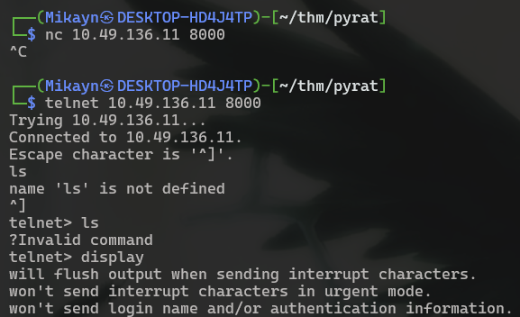

### Initial Access

Since nmap identified the service is on Python, I tried some Python reverse shells but i got an error. The error made me realize that the input might be passed directly to an interpreter. 

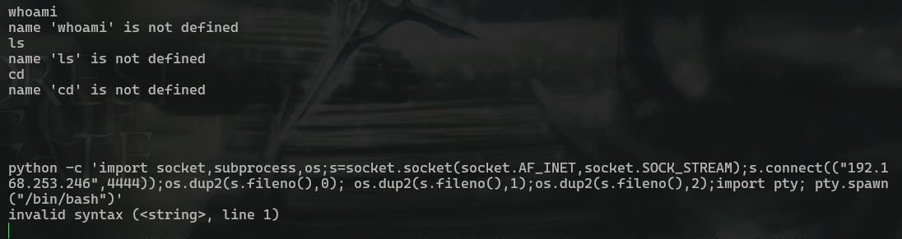

I tried other reverse shells just in case, but got the same result. So I removed the `python -c` at the start.

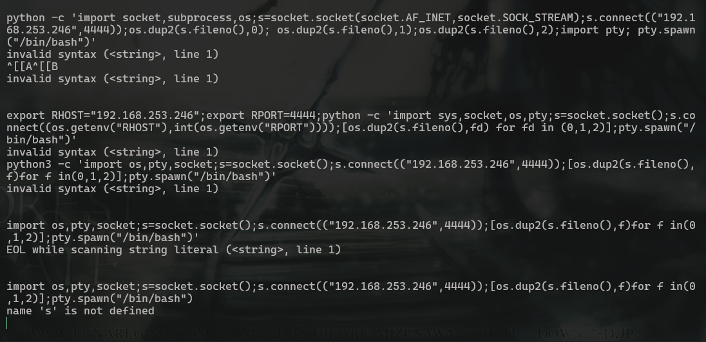

And I got a different error `name 's' is not defined`, which showed that Python was directly being interpreted by the server. My listener also briefly connected before being closed, probably because of that error. I knew i was on the right track.

The payload worked and I was in as `www-data`. 

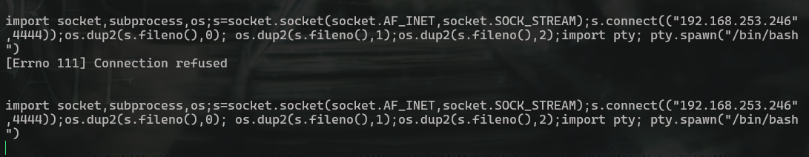

## Shell as www-data

I did some enumeration and found a user `think`. `www-data` has very little privilege so that was my target first before trying for root. 

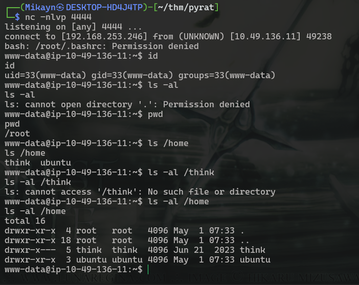

Upon further manual enumeration, i found `.git` in the `/opt/dev` directory. The hint in tryhackme says *Delving into the directories, the author uncovers a well-known folder that provides a user with access to credentials.* So, I knew that `think` password would have to be somewhere here.   

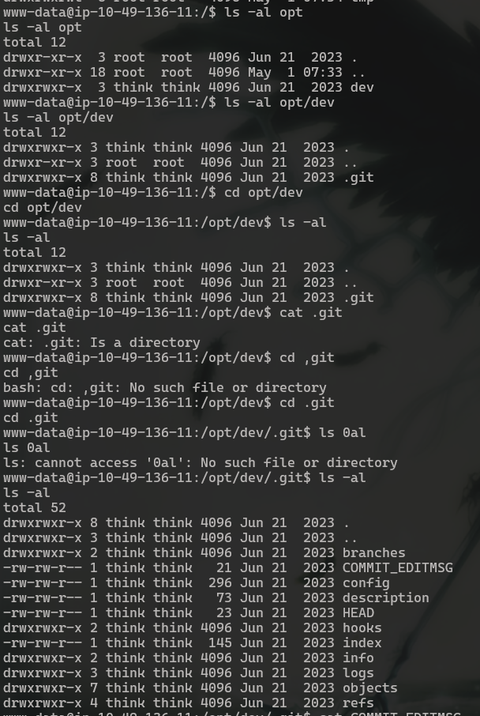

Looking around, I found `think`'s github password in the `config` file. Password reuse is a common trope and i was in the system as `think`. Thats why you always use different passwords kids.  
```bash
cat /opt/dev/.git/config
```

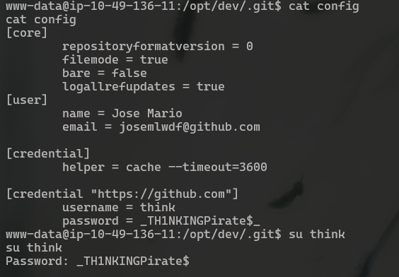

## Shell as think

### Investigating Git History

```bash
su think
```

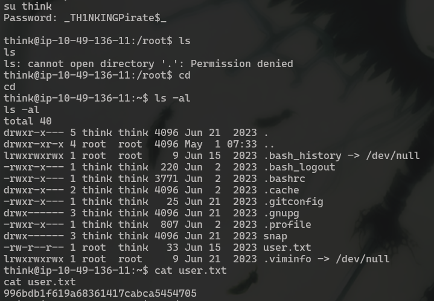

Got the user flag ez. Now time to root the machine. Thankfully, I had a hint on tryhackme which said `A subsequent exploration yields valuable insights into the application's older version`. Since git was present, I decided to check commits first. 

I also remembered this in index. So the name of the older version was `pyrat.py.old`. 

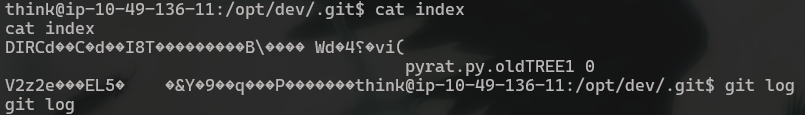

Found the previous versions by checking the changes. Did not have to look through commits so thanks author. 

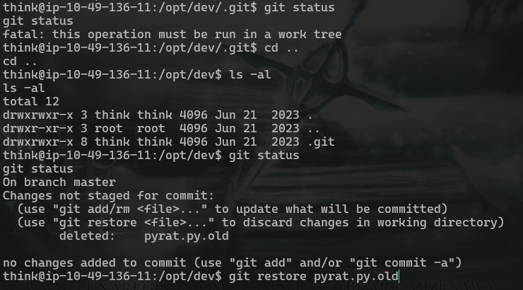

(I accidently let the machine expire at this point, so the IP used will be different). 

### Fuzzing the Endpoint

`pyrat.py.old` showed the logic at the admin endpoint.
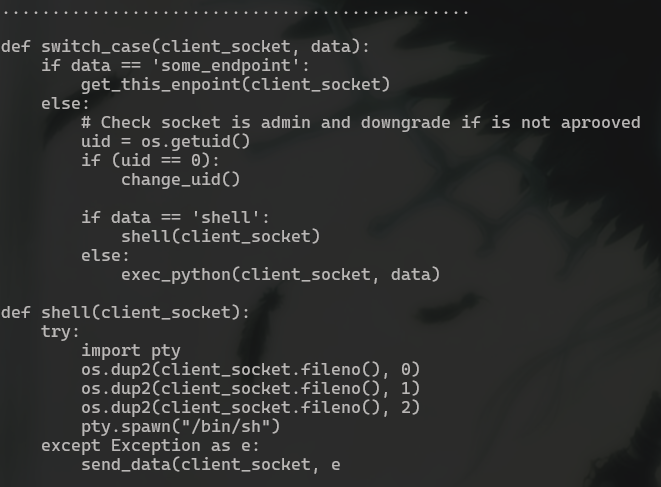

If the socket is admin, and “shell” is passed as input, it spawns a shell? Thats what I understood and I sent `admin` to the socket, and it prompted for a password.

```bash
telnet  8000
admin
```

### Brute-Forcing the Password

So this was the bruteforce the hint was talking about. But I cant bruteforce directly since I need to type “admin” for the password prompt. So a custom script was needed. 

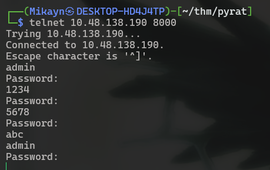

After a LOT of trial and error, i got this script to work. The script establishes a new connection per password, sends `admin`, then tests each entry from `rockyou.txt`. Its not the most efficient approach, but its reliable.

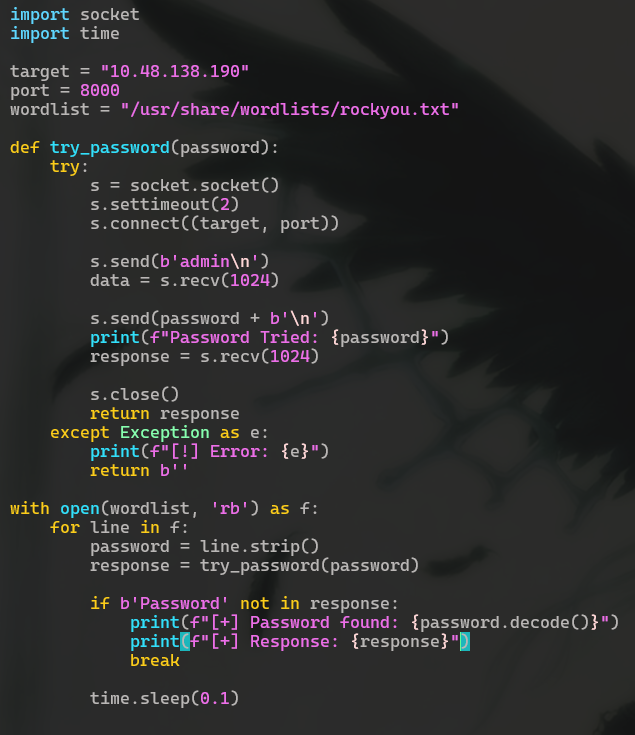

Running the script, we see that the password is `abc123`. 

### Getting Root

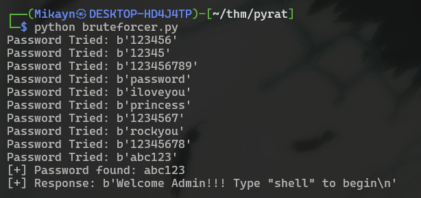

```bash
telnet  8000
admin
abc123
```

And I got the root flag. 

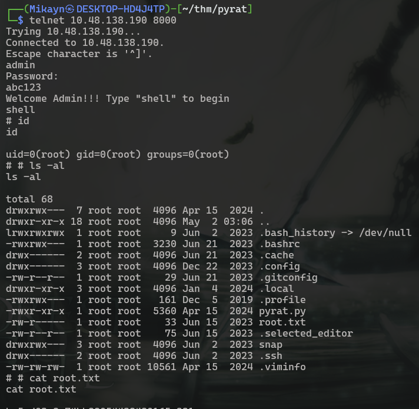

--- 

## Exploitation Chain Summary

| Step | Action | Result |
|------|--------|--------|
| 1 | Nmap scan | Port 8000 identified as Python socket server |
| 2 | Send raw Python payload to port 8000 | Reverse shell as `www-data` |
| 3 | Read `.git/config` in `/opt/dev` | Credentials for user `think` |
| 4 | SSH as `think` with reused password | User flag |
| 5 | Review old commit (`pyrat.py.old`) | Discovered hidden `admin` endpoint |
| 6 | Brute-force admin password with custom script | Password: `abc123` |
| 7 | Authenticate to admin endpoint | Root shell + root flag |
