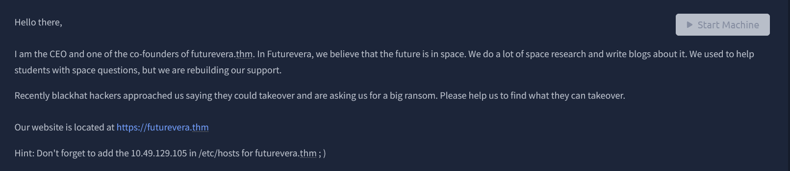
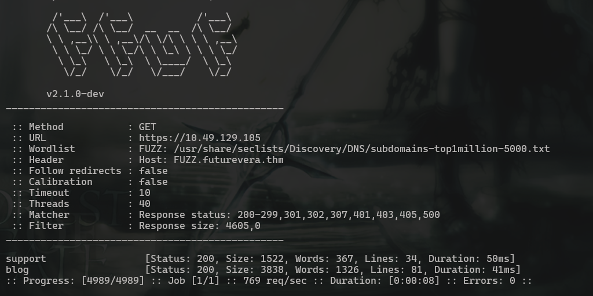
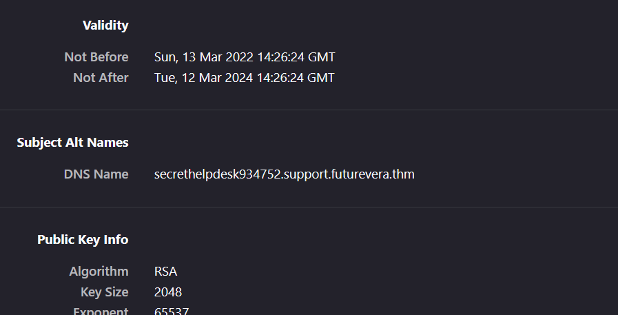

# TakeOver

**Challenge Link:** [https://tryhackme.com/room/takeover](https://tryhackme.com/room/takeover)

## **Challenge:**

- Name: TakeOver
- Description: This challenge revolves around subdomain enumeration.

## **Challenge Information:**

Before beginning the challenge, I put the IP in my /etc/hosts so I can access it. 

`<MACHINE_IP> futurevera.thm`

## **Initial Reconnaissance**

First things first, we do an nmap scan. Jk lol we already know the challenge is about subdomains.   

I skipped nmap scans directory fuzzing, source code and js files checks for this challenge and just did subdomain enum. While that was running i checked certificate since its rare for a tryhackme challenge to use https. 

`ffuf -u https://10.49.129.105 -H "Host: FUZZ.futurevera.thm" -w /usr/share/seclists/Discovery/DNS/subdomains-top1million-5000.txt -k`

- `ffuf`  The tool used to fuzz
- `-u`      Specifies the URL
- `-H`      Adds the ‘Host’ header in the request for different subdomains
- `-w`      Specifies the wordlist used. I used the popular subdomain wordlist found in seclists.
- `-k`      Ignores TLS certificate because it is self-signed and we dont want errors.

This gave `302`status for all words in wordlist. But I noticed a cheeky entry `portal` with 200. I noted that and filtered by size.  

`ffuf -u https://futurevera.thm -H "Host: FUZZ.futurevera.thm" -w /usr/share/seclists/Discovery/DNS/subdomains-top1million-5000.txt -k -fs 0`

- `-fs`    Filters the sites by the response size.

We got 2 more, `support` and `blog`. Hmm I wonder where the portal from before went. Idk why it didnt show up. 

I added all three to /etc/hosts then checked support.futurevera.thm first. 

## Further Discovery

The site was normal so i checked certificates again and found something interesting. 

We have another subdomain to check out. I added this in /etc/hosts and checked it out. 

Going to `secrethelpdesk934752.support.futurevera.thm`, we get an error message:

And thats the flag lol. Pretty simple.
